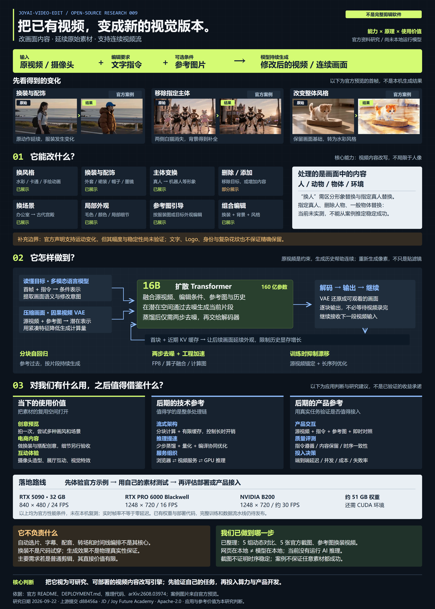
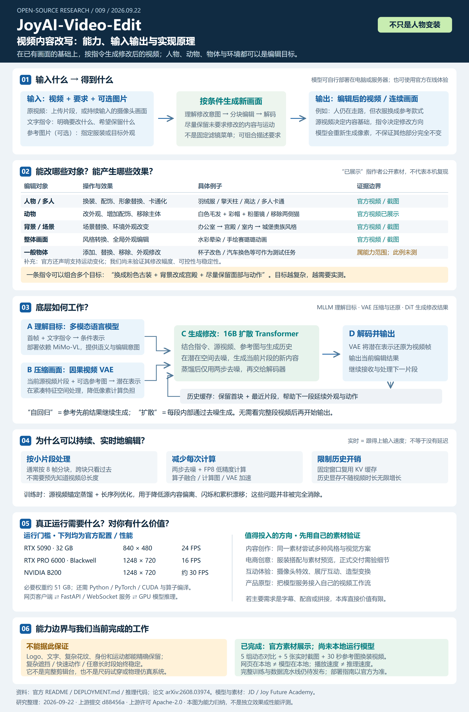
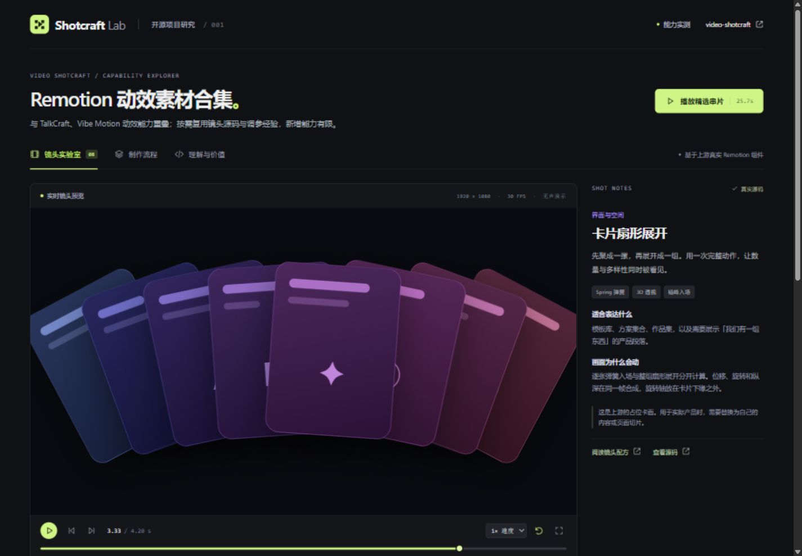
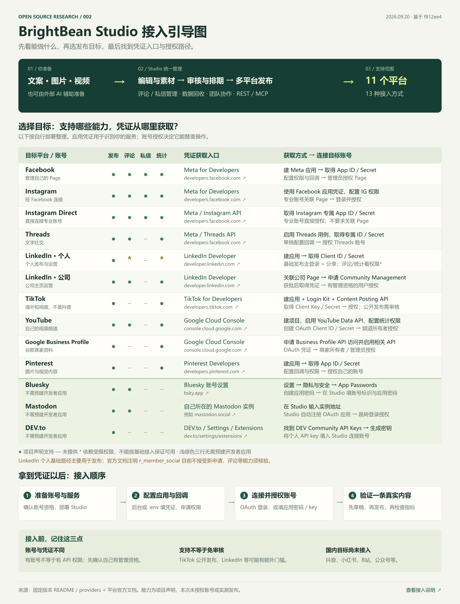
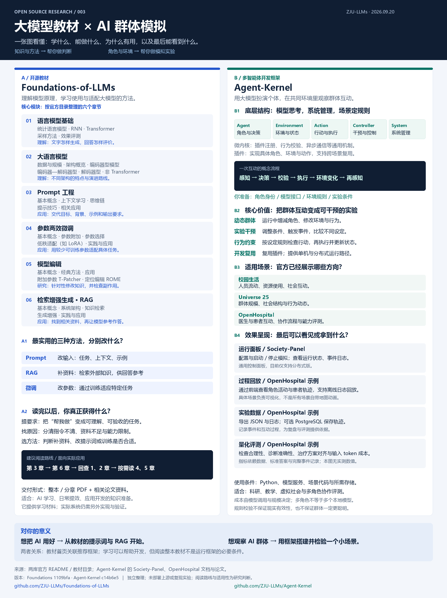
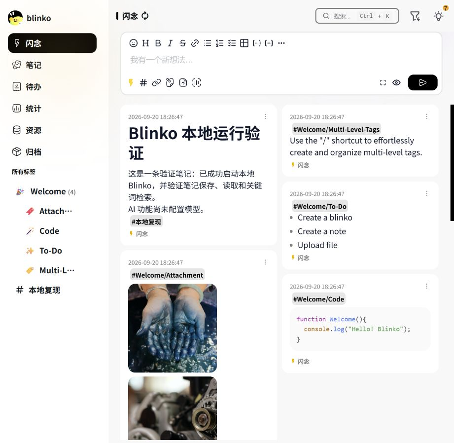
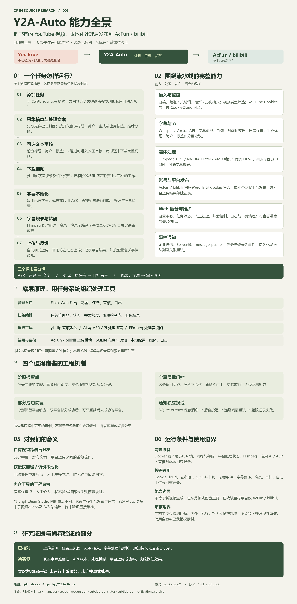
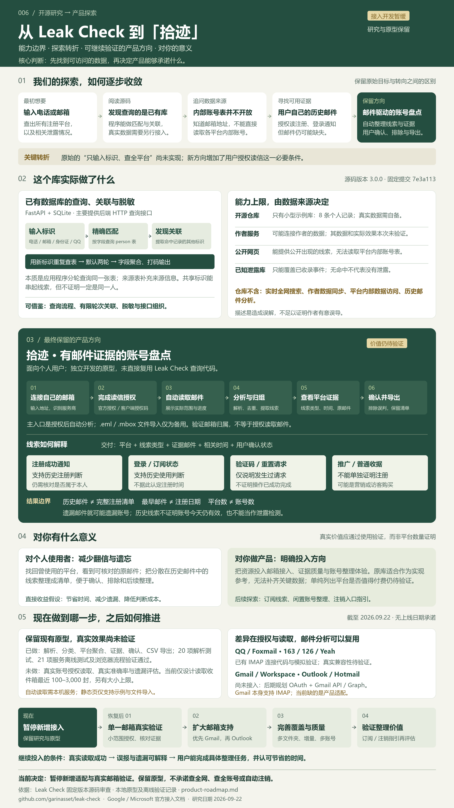
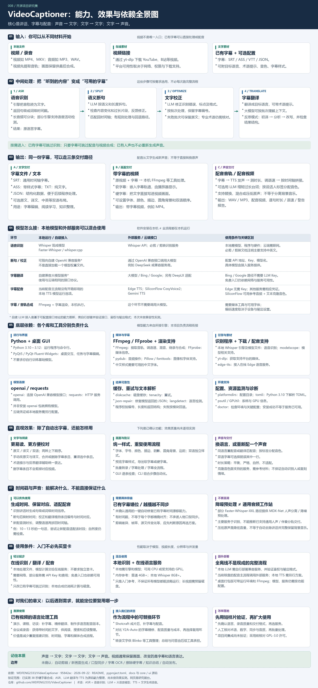

# GitHub 项目研究集

持续收录值得研究的 GitHub 开源项目，记录它们解决的问题、关键设计、复现过程与实践成果。每个项目独立整理，按固定编号顺序索引，方便查阅和持续更新。

> 收录不等于推荐；研究结论以各项目记录的版本、环境和验证结果为准。

本期图解：[009 · JoyAI-Video-Edit 双图引导](#joyai-guide) · [在线效果对照](https://yydshly.github.io/0919_codex_project/009-joyai-video-edit/)

## 项目索引

编号按收录顺序递增，分配后保持不变。点击项目名称查看研究详情，点击源库名称查看原始仓库。

<!-- PROJECT_INDEX:START -->
| 编号 | 项目 | 摘要 | 状态 | 标签 | 源库 | 演示 |
| --- | --- | --- | --- | --- | --- | --- |
| 001 | [Video Shotcraft · Remotion 动效素材合集](projects/001-video-shotcraft/README.md) | 基于 Remotion 实现的动效素材合集，附镜头配方与制作流程；与已研究的 TalkCraft、Vibe Motion 能力重叠，价值在补充镜头源码与调参经验，新增能力有限。 | 已复现 | Remotion、素材复用、动效、交互展示 | [video-shotcraft](https://github.com/Vincentwei1021/video-shotcraft) | [演示](https://yydshly.github.io/0919_codex_project/001-video-shotcraft/) |
| 002 | [BrightBean Studio · 多平台内容发布与运营后台](projects/002-brightbean-studio/README.md) | 可自建的内容编辑、审核、定时发布、互动与统计后台，提供 REST/MCP；支持 Facebook、Instagram、Threads、LinkedIn、TikTok、YouTube、Pinterest、Bluesky、Mastodon、DEV\.to 和 Google 商家资料（11 平台、13 种接入）。多数通过开发者应用凭证加账号授权接入；Bluesky 用应用密码，DEV\.to 用个人 API key，Mastodon 由程序自动注册 OAuth 应用。 | 已完成 | 社交媒体、定时发布、Django、MCP、源码研究 | [brightbean-studio](https://github.com/brightbeanxyz/brightbean-studio) | [演示](https://yydshly.github.io/0919_codex_project/002-brightbean-studio/) |
| 003 | [大模型教材与群体模拟 · Foundations &amp; Agent-Kernel](projects/003-llm-foundations-agent-kernel/README.md) | Foundations-of-LLMs：大模型相关文档与教材，覆盖原理、提示词、微调、模型编辑和 RAG；Agent-Kernel：用 AI 模拟多角色交互的开发框架，用于群体行为观察、模拟实验与协作评测。 | 已完成 | 大模型教材、多智能体、社会模拟、能力对比 | [Foundations-of-LLMs](https://github.com/ZJU-LLMs/Foundations-of-LLMs) · [Agent-Kernel](https://github.com/ZJU-LLMs/Agent-Kernel) | [演示](https://yydshly.github.io/0919_codex_project/003-llm-foundations-agent-kernel/) |
| 004 | [Blinko · Markdown 笔记记录软件](projects/004-blinko/README.md) | 支持 Markdown 的笔记记录软件，可保存文字、链接、待办和附件，围绕记录提供整理、检索、总结与 AI 问答。与 ReflectFlow 在记录及基于记录的处理上有重叠；已本地部署并验证基础笔记功能，AI 尚未配置。 | 已复现 | 个人笔记、RAG、AI、自部署、TypeScript | [blinko](https://github.com/blinkospace/blinko) | [演示](https://yydshly.github.io/0919_codex_project/004-blinko/) |
| 005 | [Y2A-Auto · YouTube 视频处理与 A/B 站发布](projects/005-y2a-auto/README.md) | 获取 YouTube 视频，经过字幕识别、翻译、烧录或转码等处理后，发布到 A 站（AcFun）或 B 站（bilibili）；支持单平台或双平台发布。 | 已完成 | 视频搬运、YouTube、AcFun、bilibili、ASR、字幕翻译、自动化、自部署、Python、Flask、Docker、yt-dlp | [Y2A-Auto](https://github.com/fqscfqj/Y2A-Auto) | [演示](https://yydshly.github.io/0919_codex_project/005-y2a-auto/) |
| 006 | [Leak Check · 数据关联原理与邮件账号盘点探索](projects/006-leak-check/README.md) | 已有个人信息库的查询后端：按电话、邮箱等精确匹配，再提取共同标识，默认两轮查表、聚合脱敏；不实时搜索全网，也不附作者数据。我们据此明确数据来源才是瓶颈，转向用户授权后的历史邮件账号盘点。原库可供实现参考，拾迹为独立原型；其价值是减少翻信、找回遗忘平台，真实效果与后续适配待验证。 | 已完成 | 源码研究、关联检索、数据边界、邮件盘点、产品探索 | [leak-check](https://github.com/garinasset/leak-check) | [演示](https://yydshly.github.io/0919_codex_project/006-leak-check/) |
| 007 | [Ebook Treasure Chest · 个人电子书链接目录](projects/007-ebook-treasure-chest/README.md) | 个人维护的书目与外部下载链接目录；仓库不含书籍正文。对我们的直接价值较低，保留分类文件生成静态搜索页的实现参考。 | 已完成 | 电子书、链接目录、静态搜索、Python、低优先级 | [ebook-treasure-chest](https://github.com/jbiaojerry/ebook-treasure-chest) | — |
| 008 | [VideoCaptioner · 字幕与配音工作台](projects/008-videocaptioner/README.md) | 把视频或录音中的讲话识别成带时间的字幕，再断句、纠错、翻译、配音并合成视频。原理是把现成语音模型、语言模型、TTS 服务与 FFmpeg 串成流程，负责时间轴对应、校验和输出；可选本地识别，完整离线需另配模型与服务。 | 已完成 | 视频字幕、语音识别、LLM、翻译、配音、Python、局部实测 | [VideoCaptioner](https://github.com/WEIFENG2333/VideoCaptioner) | [演示](https://yydshly.github.io/0919_codex_project/008-videocaptioner/) |
| 009 | [JoyAI-Video-Edit · 视频内容改写与效果展示](projects/009-joyai-video-edit/README.md) | 以原视频、文字指令和可选参考图为输入，替换视频中的人物形象、换装、转换风格、增删画面内容并更换背景；梳理分块扩散生成原理、GPU 部署条件与创意验证价值，展示官方前后对比及两张引导图。 | 已完成 | 视频内容改写、人物形象替换、风格与背景转换、扩散模型、官方案例展示 | [JoyAI-Video-Edit](https://github.com/jd-opensource/JoyAI-Video-Edit) | [演示](https://yydshly.github.io/0919_codex_project/009-joyai-video-edit/) |
<!-- PROJECT_INDEX:END -->

<a id="joyai-guide"></a>
## 009 · JoyAI-Video-Edit 双图引导

这个库以**原视频或摄像头画面 + 文字指令 + 可选参考图**为输入，持续生成编辑后的视频。它可以改写人物形象与服装、整体风格、画面内容和背景；下面两张图把官方案例、实现原理、运行门槛与我们可借鉴的方向串在一起。图示依据[上游项目](https://github.com/jd-opensource/JoyAI-Video-Edit)的公开资料整理，**不是本机模型实测**。另见[交互效果展示](https://yydshly.github.io/0919_codex_project/009-joyai-video-edit/)和[完整研究记录](projects/009-joyai-video-edit/README.md)。

### 先看深色图：能力、案例与应用价值

从“输入什么、能改什么”开始，结合官方前后对照理解换装、人物形象替换、风格转换、内容增删及场景变化；下半部分汇总分块生成原理、显卡门槛和对内容创作、互动原型的参考价值。点击图片可打开可放大的 SVG。

[](projects/009-joyai-video-edit/assets/joyai-capability-overview-v2.svg)

### 再看浅色图：输入、模型与输出的关系

沿着“视频与指令 → 多模态理解和压缩 → 16B 扩散模型分块生成 → 编辑后画面”追踪底层路径，并区分官方已展示的效果、我们仍需验证的边界与实际部署条件。点击图片可打开可放大的 SVG。

[](projects/009-joyai-video-edit/assets/joyai-capability-overview.svg)

## 项目图览

每个子项目可以提供一张封面截图及简短描述，详细截图、操作步骤和结论收录在子项目 README 中。

<!-- PROJECT_GALLERY:START -->
### 001 · [Video Shotcraft · Remotion 动效素材合集](projects/001-video-shotcraft/README.md)

基于 Remotion 实现的动效素材合集，附镜头配方与制作流程；与已研究的 TalkCraft、Vibe Motion 能力重叠，价值在补充镜头源码与调参经验，新增能力有限。

[](projects/001-video-shotcraft/README.md)

### 002 · [BrightBean Studio · 多平台内容发布与运营后台](projects/002-brightbean-studio/README.md)

可自建的内容编辑、审核、定时发布、互动与统计后台，提供 REST/MCP；支持 Facebook、Instagram、Threads、LinkedIn、TikTok、YouTube、Pinterest、Bluesky、Mastodon、DEV\.to 和 Google 商家资料（11 平台、13 种接入）。多数通过开发者应用凭证加账号授权接入；Bluesky 用应用密码，DEV\.to 用个人 API key，Mastodon 由程序自动注册 OAuth 应用。

[](projects/002-brightbean-studio/README.md)

### 003 · [大模型教材与群体模拟 · Foundations &amp; Agent-Kernel](projects/003-llm-foundations-agent-kernel/README.md)

Foundations-of-LLMs：大模型相关文档与教材，覆盖原理、提示词、微调、模型编辑和 RAG；Agent-Kernel：用 AI 模拟多角色交互的开发框架，用于群体行为观察、模拟实验与协作评测。

[](projects/003-llm-foundations-agent-kernel/README.md)

### 004 · [Blinko · Markdown 笔记记录软件](projects/004-blinko/README.md)

支持 Markdown 的笔记记录软件，可保存文字、链接、待办和附件，围绕记录提供整理、检索、总结与 AI 问答。与 ReflectFlow 在记录及基于记录的处理上有重叠；已本地部署并验证基础笔记功能，AI 尚未配置。

[](projects/004-blinko/README.md)

### 005 · [Y2A-Auto · YouTube 视频处理与 A/B 站发布](projects/005-y2a-auto/README.md)

获取 YouTube 视频，经过字幕识别、翻译、烧录或转码等处理后，发布到 A 站（AcFun）或 B 站（bilibili）；支持单平台或双平台发布。

[](projects/005-y2a-auto/README.md)

### 006 · [Leak Check · 数据关联原理与邮件账号盘点探索](projects/006-leak-check/README.md)

已有个人信息库的查询后端：按电话、邮箱等精确匹配，再提取共同标识，默认两轮查表、聚合脱敏；不实时搜索全网，也不附作者数据。我们据此明确数据来源才是瓶颈，转向用户授权后的历史邮件账号盘点。原库可供实现参考，拾迹为独立原型；其价值是减少翻信、找回遗忘平台，真实效果与后续适配待验证。

[](projects/006-leak-check/README.md)

### 008 · [VideoCaptioner · 字幕与配音工作台](projects/008-videocaptioner/README.md)

把视频或录音中的讲话识别成带时间的字幕，再断句、纠错、翻译、配音并合成视频。原理是把现成语音模型、语言模型、TTS 服务与 FFmpeg 串成流程，负责时间轴对应、校验和输出；可选本地识别，完整离线需另配模型与服务。

[](projects/008-videocaptioner/README.md)

### 009 · [JoyAI-Video-Edit · 视频内容改写与效果展示](projects/009-joyai-video-edit/README.md)

以原视频、文字指令和可选参考图为输入，替换视频中的人物形象、换装、转换风格、增删画面内容并更换背景；梳理分块扩散生成原理、GPU 部署条件与创意验证价值，展示官方前后对比及两张引导图。

[](projects/009-joyai-video-edit/README.md)
<!-- PROJECT_GALLERY:END -->

## 仓库结构

```text
projects/                    按编号组织的研究子项目
  001-project-slug/          首个项目的目录格式（示意）
    project.json            索引元信息
    README.md               项目介绍、截图、运行方式、研究结论
    notes/                  研究记录与实验笔记
    assets/                 截图、封面和演示 GIF
templates/project/          新项目模板
scripts/project.py          新增项目、同步首页与校验索引
docs/                       收录规范与后续部署约定
web/                        已构建的静态演示与总入口
```

## 新增研究项目

需要 Python 3.10 或更高版本，无第三方依赖。在仓库根目录运行：

```sh
python scripts/project.py add example-project --name "项目名称" --source "https://github.com/owner/repo" --summary "用一句话说明项目用途与研究重点"
```

工具会分配下一个编号、复制研究模板并更新首页索引。随后填写子项目 README，把截图放入 `assets/`，在 `project.json` 的 `cover` 中填写相对路径（例如 `assets/cover.png`）。

```sh
python scripts/project.py sync   # 修改元信息或图片后更新首页
python scripts/project.py check  # 检查编号、路径及首页是否同步
```

## 维护说明

- [项目收录与编号规范](docs/project-guide.md)
- [多个 Web 演示的部署约定](docs/deployment.md)
- [子项目 README 模板](templates/project/README.md)

上游项目的作者、链接、版本与许可证在各子项目中单独记录。转载代码与资源时保留上游许可证和署名。
