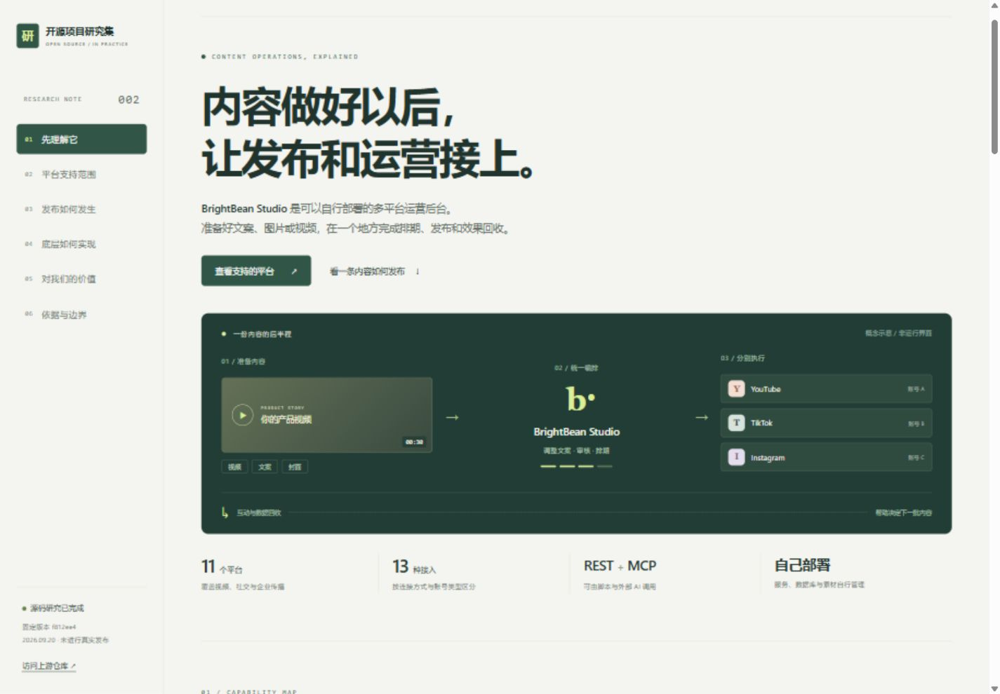

# 002 · BrightBean Studio：多平台内容发布与运营后台

把已经准备好的文案、图片和视频，按不同平台调整、审核、排期并发布，再集中管理互动和查看效果。它是一套可自行部署的 Web 应用，也通过 REST API / MCP 向外部 AI 助手开放操作能力。

**支持目标：** Facebook、Instagram、Threads、LinkedIn、TikTok、YouTube、Pinterest、Bluesky、Mastodon、DEV.to、Google Business Profile（谷歌商家资料），合计 11 个平台、13 种接入方式。各平台的评论、私信与统计能力不完全相同；目前没有现成的国内主流平台接入。

**接入方式：** 多数平台先在开发者后台取得应用凭证，再由账号所有者或管理员登录授权；Bluesky 使用应用密码，DEV.to 使用个人 API key，Mastodon 由 Studio 在目标实例自动注册 OAuth 应用后引导授权。支持范围不等于新账号必定能取得所有权限。

[返回总索引](../../README.md) · [上游仓库](https://github.com/brightbeanxyz/brightbean-studio) · [实现原理](architecture.md) · [研究记录](notes/README.md)

**能力与接入引导图：** [查看 SVG 矢量原图](assets/connection-guide.svg) · [下载 PNG](assets/connection-guide.png) · [文字说明与官方入口](connection-guide.md)。一图汇总核心能力、11 个平台的 13 种连接、应用凭证获取方式和账号授权路径；以自行部署为准。

## 项目信息

| 项目 | 内容 |
| --- | --- |
| 研究编号 | 002 |
| 上游版本 | `f812ee4e3c2c7186c7236a49f6eafb491137ac35` |
| 上游提交日期 | 2026-09-18 |
| 研究日期 | 2026-09-20 |
| 上游许可证 | AGPL-3.0，见[固定版本 LICENSE][license] |
| 技术栈 | Python / Django、Django 模板、HTMX、Alpine.js、Tailwind CSS、PostgreSQL、django-background-tasks |
| 本次环境 | Windows；本地阅读固定版本源码，联网核对官方说明 |
| 研究范围 | 已完成能力与源码整理；未部署上游应用、未连接账号、未验证真实社交发布 |

元信息中的“已完成”表示能力整理与研究网页完成，不表示上游产品已通过端到端验证。下方页面是我们制作的交互研究页，其中发布状态为模拟示意。

## 交互研究网页

[打开本地研究页](http://127.0.0.1:5184/002-brightbean-studio/) · [网页源码](site/index.html) · [网站总入口源码](../../web/index.html)

网页包含能力与接入引导图、平台能力筛选、中文搜索、逐个平台的接入说明、五步发布流程、架构解读、适用场景与证据边界。无第三方前端依赖，不需要 API 密钥，所有交互均在本地浏览器完成。



在仓库根目录构建并预览：

```sh
python projects/002-brightbean-studio/scripts/build_web.py
python -m http.server 5184 --bind 127.0.0.1 --directory web
```

发布文件输出至 `web/002-brightbean-studio/`，已加入现有 GitHub Pages 构建流程。部署状态与访问验证记录见 [研究记录](notes/README.md)，通过验证的公网地址统一保存在 `project.json` 的 `demo` 字段。

## 核心能力

可以理解为“多平台发布工具 + 内容运营后台”。例如，上传一支产品视频，分别设置 YouTube、TikTok 和 Instagram 的文案与时间，由后台执行发布，再查看各平台返回的数据。

| 能力 | 用户可以做什么 | 边界 |
| --- | --- | --- |
| 多平台编辑 | 复用内容，为不同账号设置标题、文案、首条评论和媒体差异 | 发布形式、字数和素材规格受目标平台约束 |
| 日历与队列 | 提前排期，设置每周发布时段，使用队列分配空闲时段 | 循环时段不等于同一帖子自动循环重发；后台进程必须运行 |
| 发布执行 | 调用平台接口发布，记录成功、失败、限流和重试 | 多平台可能部分成功，不保证同时上线 |
| 团队与客户审核 | 按工作区隔离客户，配置成员权限与审核流程 | 自动化接口也受权限和必需审核约束 |
| 素材库 | 组织文件夹、检索素材、生成缩略图、处理图片和视频 | 素材管理与加工不等于生成原创视频 |
| 统一收件箱 | 集中处理支持平台的评论、提及、私信等，并准备回复 | 各平台能力不同，见下表 |
| 数据统计 | 查看平台提供的帖子与账号指标、趋势 | 数据与权限因平台而异，指标口径未必相同 |
| 自动化接口 | 外部程序或 AI 创建草稿、排期、管理素材、查数据和处理回复 | 需先完成接口接入和账号授权 |

依据：[官方功能说明][readme]、[内容数据模型][models]、[素材处理任务][media]。

## 平台支持矩阵

研究版本覆盖 **11 个平台、13 种接入方式**。Instagram 提供两种连接方式，LinkedIn 区分个人和公司账号。下表按上游 README 公布的能力整理，并核对了 provider 注册表；不是本次逐个平台实测的结果。

✓：项目声明支持；—：支持矩阵未列出该能力。

| 平台 / 接入方式 | 发布 | 评论 | 私信 | 数据统计 |
| --- | :---: | :---: | :---: | :---: |
| Facebook | ✓ | ✓ | ✓ | ✓ |
| Instagram（经 Facebook 连接） | ✓ | ✓ | ✓ | ✓ |
| Instagram Direct（直接连接） | ✓ | ✓ | ✓ | ✓ |
| LinkedIn（个人账号） | ✓ | ✓ | — | ✓ |
| LinkedIn（公司账号） | ✓ | ✓ | — | ✓ |
| TikTok | ✓ | — | — | ✓ |
| YouTube | ✓ | ✓ | — | ✓ |
| Pinterest | ✓ | — | — | ✓ |
| Threads | ✓ | ✓ | — | ✓ |
| Bluesky | ✓ | ✓ | — | — |
| Google Business Profile（谷歌商家资料） | ✓ | — | — | ✓ |
| Mastodon（长毛象） | ✓ | ✓ | — | — |
| DEV.to（开发者社区） | ✓ | — | — | — |

来源：[固定版本官方说明][readme]、[平台注册表][registry]。

### 已覆盖的主要用途

- 视频与视觉内容：YouTube、TikTok、Instagram、Pinterest。
- 品牌与企业传播：Facebook、Threads、LinkedIn。
- 其他社区与商家运营：Bluesky、Mastodon、DEV.to、Google Business Profile。

### 当前没有现成接入的平台

- 海外：X、Reddit、Snapchat、Discord、Telegram。
- 国内：小红书、抖音、快手、B站、微信公众号、视频号、微博、知乎。

**TikTok 与国内抖音不是同一个接入。** 海外覆盖已足以支撑许多内容分发场景，但不能概括为“所有主流平台都有了”。“支持发布”也不表示该平台所有帖子形式、账号类型和原生功能都可用。

## AI 与自动化能力

MCP 和 REST API 让外部 AI 助手或脚本操作 Studio。已有工具包括创建草稿、安排发布、查询帖子与素材、读取统计、准备回复和发送回复。两种入口复用业务服务和权限检查。

可以围绕这些接口构建：

```text
外部 AI 整理文案与素材
    → Studio 保存各平台草稿
    → 人工检查 / 按工作区规则审核
    → Studio 排期和执行发布
    → 外部 AI 读取指标，协助复盘
```

这是可基于接口搭建的工作流，本研究尚未完成该集成。源码入口见 [MCP handlers][mcp]。

两个容易误解的点：

- 基础收件箱情感分析使用英文正负面关键词计数，并非大模型语义分析；对中文与复杂语境的效果不能据此保证。见[情感分析代码][sentiment]。
- 源码包含可选的外部 Intelligence 服务集成、订阅和额度逻辑，相关配置缺失时默认关闭。README 对核心 Studio 的免费描述，不能扩展为“外部智能服务也全部免费、离线可用”。见[设置][settings]与[订阅模型][intelligence]。

## 使用场景与对我们的意义

| 场景 | 判断 |
| --- | --- |
| 持续运营多个海外账号 | 价值较高，可减少重复登录、上传、排期和数据汇总 |
| 为多个客户做代运营 | 价值较高，可复用工作区、权限和客户审核 |
| 推广产品或开源项目 | 有价值，适合围绕一次发布活动组织多平台内容 |
| 构建 AI 内容运营助手 | 有研究价值，已有 REST/MCP 和权限体系可作为执行层 |
| 主要运营国内内容平台 | 直接价值较低，缺少现成平台适配 |
| 偶尔向单一账号发内容 | 自建维护成本可能超过节省的操作成本 |

与已有 [Video Shotcraft](../001-video-shotcraft/README.md)、TalkCraft、Vibe Motion 研究相比，它补充内容制作之后的环节：**制作成品 → 分平台发布 → 收集互动与指标 → 调整下一批内容。** 实际价值取决于是否存在持续运营这些平台的需求。

最值得借鉴的设计是“共同内容 + 每个目标账号独立状态”、平台适配接口，以及让人工界面和 AI 接口共用业务约束。详见[实现原理](architecture.md)。

## 运行条件与验证范围

上游提供 Docker 和本地 Python 启动路径。生产使用需要 Web 服务、后台任务进程、数据库和持久化素材存储。接入账号还需要平台开发者凭证、授权及可能的权限审核。部分平台主动抓取素材 URL，因此素材地址必须满足平台的访问要求。

启动与配置入口：[固定版本 README][readme]、[环境变量示例][env]。本次没有安装上游依赖、启动上游服务、运行上游测试、连接账号或发布帖子。研究网页的截图与交互检查只验证我们制作的展示页。

若进入实用验证，建议先选一个实际经营的平台，用一支已有视频跑通“上传 → 草稿 → 排期 → 发布确认 → 指标回收”，再加入第二个平台观察部分失败的处理。详细范围见[研究记录](notes/README.md)。

## 来源与许可

本目录为自行撰写的研究文档，结论锚定上述完整提交。仅引用上游链接和代码标识，没有复制上游应用源码、截图或媒体，也未将上游嵌套仓库纳入本项目。上游代码采用 AGPL-3.0；后续引入代码或资源时应另行记录范围并保留相应许可与署名。

[readme]: https://github.com/brightbeanxyz/brightbean-studio/blob/f812ee4e3c2c7186c7236a49f6eafb491137ac35/README.md
[license]: https://github.com/brightbeanxyz/brightbean-studio/blob/f812ee4e3c2c7186c7236a49f6eafb491137ac35/LICENSE
[models]: https://github.com/brightbeanxyz/brightbean-studio/blob/f812ee4e3c2c7186c7236a49f6eafb491137ac35/apps/composer/models.py
[media]: https://github.com/brightbeanxyz/brightbean-studio/blob/f812ee4e3c2c7186c7236a49f6eafb491137ac35/apps/media_library/tasks.py
[registry]: https://github.com/brightbeanxyz/brightbean-studio/blob/f812ee4e3c2c7186c7236a49f6eafb491137ac35/providers/__init__.py
[mcp]: https://github.com/brightbeanxyz/brightbean-studio/blob/f812ee4e3c2c7186c7236a49f6eafb491137ac35/apps/mcp/handlers.py
[sentiment]: https://github.com/brightbeanxyz/brightbean-studio/blob/f812ee4e3c2c7186c7236a49f6eafb491137ac35/apps/inbox/sentiment.py
[settings]: https://github.com/brightbeanxyz/brightbean-studio/blob/f812ee4e3c2c7186c7236a49f6eafb491137ac35/config/settings/base.py
[intelligence]: https://github.com/brightbeanxyz/brightbean-studio/blob/f812ee4e3c2c7186c7236a49f6eafb491137ac35/apps/intelligence/models.py
[env]: https://github.com/brightbeanxyz/brightbean-studio/blob/f812ee4e3c2c7186c7236a49f6eafb491137ac35/.env.example
