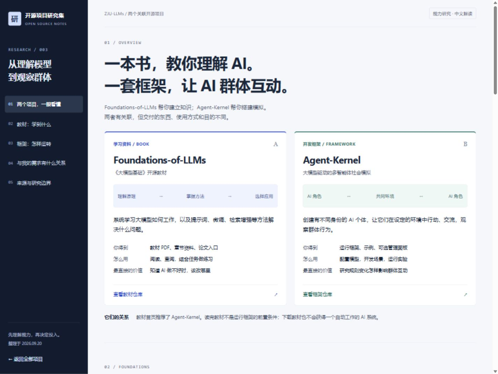

# 003 · 大模型教材与群体模拟

**Foundations-of-LLMs 是大模型相关文档与教材；Agent-Kernel 是用 AI 模拟多角色交互的开发框架。** 本项目把两个关联仓库放在一起研究，说明能力、原理、场景与实际价值。

[返回总索引](../../README.md) · [教材仓库](https://github.com/ZJU-LLMs/Foundations-of-LLMs) · [框架仓库](https://github.com/ZJU-LLMs/Agent-Kernel) · [在线研究网页](https://yydshly.github.io/0919_codex_project/003-llm-foundations-agent-kernel/) · [本地预览](http://127.0.0.1:5185/003-llm-foundations-agent-kernel/) · [网页源码](site/index.html)

## 研究版本与范围

| 项目 | 记录 |
| --- | --- |
| 研究日期 | 2026-09-20 |
| 教材版本 | `1109bfa8e1c5b83fd25f66435601eef2a5905d5b` |
| 框架版本 | `c14b6e59ab6df517238ae64e9a9b0ac1a7bb3be7` |
| 教材许可 | [CC BY-NC-ND 4.0](https://github.com/ZJU-LLMs/Foundations-of-LLMs/blob/1109bfa8e1c5b83fd25f66435601eef2a5905d5b/LICENSE.md) |
| 框架许可 | [Apache-2.0](https://github.com/ZJU-LLMs/Agent-Kernel/blob/c14b6e59ab6df517238ae64e9a9b0ac1a7bb3be7/LICENSE) |
| 本页技术 | 原生 HTML、CSS、JavaScript；Python 标准库构建脚本 |
| 验证范围 | 官方说明与论文核对、研究页交互与布局检查；未部署上游系统、连接模型或复现实验 |

元信息的“已完成”表示能力整理与研究网页完成，不表示上游软件已经实测。“研究版本”用于追溯说明来源；内容没有声称覆盖所有实现细节。

## 交互研究网页

**一图完整汇总：** [高清 PNG](assets/capability-overview.png) · [矢量 SVG](assets/capability-overview.svg) · [网页内查看](https://yydshly.github.io/0919_codex_project/003-llm-foundations-agent-kernel/#capability-map)。左侧包含教材六章核心主题；右侧包含框架结构、价值、场景与面板、回放、实验数据、评测四种结果呈现。

效果呈现核对了 [Society-Panel 文档](https://github.com/ZJU-LLMs/Agent-Kernel/blob/c14b6e59ab6df517238ae64e9a9b0ac1a7bb3be7/society-panel/README.md) 和 [OpenHospital 文档](https://github.com/ZJU-LLMs/Agent-Kernel/blob/c14b6e59ab6df517238ae64e9a9b0ac1a7bb3be7/demo/OpenHospital/README.md)。Society-Panel 目前只支持分布式版；医院的轨迹回放和评测属于具体示例，不能扩展成所有场景都有同样界面与指标。



网页整理以下内容：

1. 两个项目的定位、交付物和使用方式并排比较。
2. 六个教材章节的交互解读，包含工作示例与方法边界。
3. “感知 → 决策 → 校验 → 执行 → 再互动”五步教学示意。
4. 日常提效、知识库、群体研究和多 AI 分工的需求对照。
5. 单图能力总览及 PNG / SVG 下载。
6. 多角色产品方向、优先验证场景与评价标准。
7. 固定版本来源、论文入口与研究范围。

页面中的角色行为是自行编写的概念示例，不是 Agent-Kernel 的实际输出。无模型调用、第三方追踪或前端依赖。

## 能力与原理

| 维度 | Foundations-of-LLMs | Agent-Kernel |
| --- | --- | --- |
| 定位 | 开源教材与论文资料 | 多智能体社会模拟框架 |
| 使用方式 | 阅读、查阅、结合任务练习 | 接入模型、配置与开发场景、运行实验 |
| 核心内容 | 模型基础、架构、提示词、参数高效微调、模型编辑、RAG | 角色、环境、动作、控制器和系统的协调 |
| 原理 | 解释生成、上下文学习、参数更新与外部知识检索 | 微内核与插件分离，将认知、行动执行与环境分开管理 |
| 典型场景 | 理解模型、改善指令、学习应用方法 | 校园、人口动态、医院流程等群体模拟 |
| 需要补充 | 实际项目与效果验证 | 模型服务、具体角色逻辑、环境规则与实验设计 |

来源：[教材说明与目录](https://github.com/ZJU-LLMs/Foundations-of-LLMs/blob/1109bfa8e1c5b83fd25f66435601eef2a5905d5b/readme.md)、[Agent-Kernel 官方说明](https://github.com/ZJU-LLMs/Agent-Kernel/blob/c14b6e59ab6df517238ae64e9a9b0ac1a7bb3be7/README.md)、[框架论文](https://arxiv.org/abs/2512.01610)。

## 对我们的意义

- 希望改善日常 AI 使用：优先阅读提示词章节，带着实际任务练习。
- 希望开发文档问答：先理解 RAG，与提示词、微调区分开来。
- 希望观察 AI 群体交互：Agent-Kernel 的角色、环境、行为校验与实验管理值得研究。
- 希望自动完成办公室工作：不能把社会模拟框架直接当成现成的 AI 办公团队。

这些是基于项目定位的研究判断。模拟结果只能说明模型在相应规则与条件下的表现，现实有效性还需独立数据验证。

## 多角色的产品方向

我们的判断：有意义的方向是把交互过程做成可演练、可比较、可复盘的试验场。可探索沟通陪练、AI 助手测试、服务流程沙盘、协作与应急演练、游戏 NPC、方案与传播推演。优先验证沟通陪练和 AI 助手测试台的单一小场景。

选择标准是：角色真的互相影响、结果能够验证、用户有重复使用需求。这些是待验证的产品假设，不能当作现成框架功能或已经验证的商业机会。完整整理见 [多角色产品方向](product-directions.md)。

## 本地构建与预览

在仓库根目录执行：

```sh
python projects/003-llm-foundations-agent-kernel/scripts/build_web.py
python -m http.server 5185 --bind 127.0.0.1 --directory web
```

打开 `http://127.0.0.1:5185/003-llm-foundations-agent-kernel/`。本页适配 GitHub Pages 子路径；构建输出为 `web/003-llm-foundations-agent-kernel/`，总入口和现有发布工作流已接入本项目。已通过 GitHub Pages 发布至 [在线研究页](https://yydshly.github.io/0919_codex_project/003-llm-foundations-agent-kernel/)。2026-09-20 验证主页面、总览图、产品方向文档、章节与流程交互正常，`project.json` 的 `demo` 已记录正式地址。

## 来源与许可

本研究只保存自行撰写的文字、界面与教学示意，未复制上游教材 PDF、框架源码或媒体。后续若引入上游资源，应单独记录范围并遵守对应许可。

技术参考：[Transformer](https://arxiv.org/abs/1706.03762)、[上下文学习](https://arxiv.org/abs/2005.14165)、[LoRA](https://arxiv.org/abs/2106.09685)、[RAG](https://arxiv.org/abs/2005.11401)、[Agent-Kernel 单机示例](https://github.com/ZJU-LLMs/Agent-Kernel/blob/c14b6e59ab6df517238ae64e9a9b0ac1a7bb3be7/examples/standalone_test/README.md)。

验证细节见 [研究记录](notes/README.md)。
