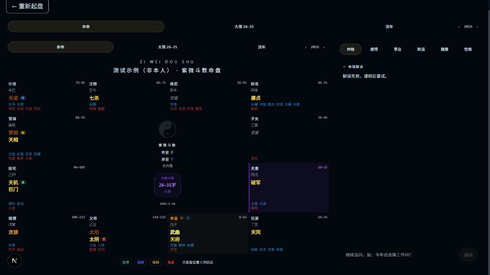

# 010 · 紫微斗数源库实测与结论

[查看展示页](../../web/010-ziwei-doushu/) · [上游仓库](https://github.com/Renhuai123/ziwei-doushu)

## 结论

上游仓库以前端排盘展示为主，浏览器端可以按规则生成紫微斗数命盘，但没有支撑完整 AI 解读的后端业务逻辑。实际运行时，网页调用 `/api/interpret` 返回 404。对我们只有有限的界面与规则实现参考价值，进一步研究收益不高，本项目到此收束。

## 实测效果

固定上游提交 `9d98b3ae7fce298f751cb43c47783d6e84a7735d`。在本机运行原库，用虚构姓名“测试示例（非本人）”、公历 1995-06-15 12:00、北京、男提交表单。原版页面生成十二宫与星曜；AI 解读区域报接口不可用。完整截图如下：

本地 `npm run typecheck` 与 `npm test` 通过，浏览器访问 `/chart` 返回 200，`/api/interpret` 返回 404。我们未验证命理预测准确性，未下载全量样本，未调用付费 AI 服务。

## 实现与价值边界

- 排盘层使用 TypeScript、`iztro`、`lunar-javascript` 和仓库内规则处理命盘与格局。
- 参考文本及作者所述 518,400 条样本可作为资料，但样本是程序生成，不是真实人生结果的验证数据。
- AI 解读接口、完整断语内容与商业服务需要自行构建；网页展示不能代替这些能力。
- 代码为 MIT 许可；样本另按 CC BY 4.0 许可。使用上游资产时按各自许可处理。

本项目只公开简要说明与真实运行截图，不部署原库服务，也不收集出生信息。

## 构建与来源

在仓库根目录运行 `python projects/010-ziwei-doushu/scripts/build_web.py`，输出到 `web/010-ziwei-doushu/`。可执行 `python -m http.server 5194 --bind 127.0.0.1 --directory web` 本地预览。原库本地启动脚本保留于 `scripts/start_upstream.ps1`，前提是已在 `.local/ziwei-doushu-upstream/` 安装依赖。

[固定版本源码](https://github.com/Renhuai123/ziwei-doushu/tree/9d98b3ae7fce298f751cb43c47783d6e84a7735d) · [数据许可](https://github.com/Renhuai123/ziwei-doushu/blob/9d98b3ae7fce298f751cb43c47783d6e84a7735d/DATASET-LICENSE) · [详细验证记录](notes/README.md)
