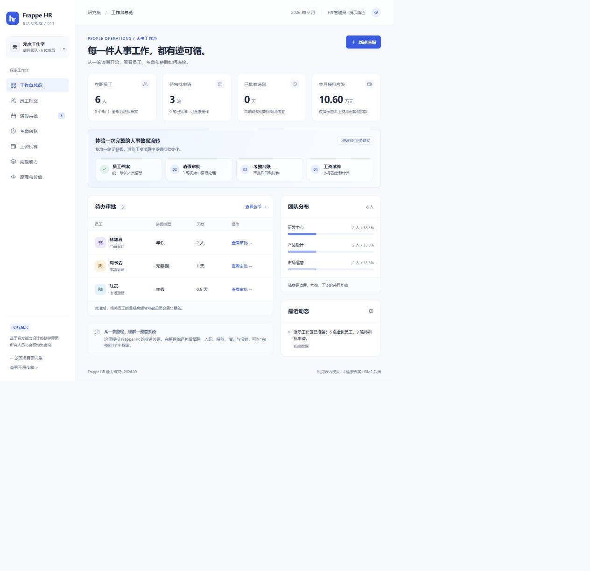

# 011 · Frappe HR · 人事与薪酬工作台

以一张能力总览图和 24 个学习维度，分析 Frappe HR 的业务能力、技术实现及复用价值，并提供官方运行实例与独立教学演示。

[在线研究页](https://yydshly.github.io/0919_codex_project/011-frappe-hrms/) · [返回总索引](../../README.md) · [上游仓库](https://github.com/frappe/hrms) · [官方文档](https://docs.frappe.io/hr/introduction)

## 交付范围

本项目包含两套可区分的体验：

- **官方源码实例**：已在本机运行 Frappe HR 16.19.0、ERPNext 16.35.0 与 Frappe 16.34.0，访问 [真实系统](http://127.0.0.1:8191)。使用官方界面、Python 业务逻辑和 MariaDB 数据库，已导入 6 位虚拟员工、请假、考勤、工资及招聘资料。启动、账号位置与演示步骤见 [运行说明](runtime/README.md)。
- **原创教学页面**：[远端网页](https://yydshly.github.io/0919_codex_project/011-frappe-hrms/) 展示能力总览、24 个业务与技术学习维度，以及独立编写的中文交互模拟；数据保存在浏览器中，它不是官方界面。以下体验说明均针对教学页面。

两套环境的数据互不相通。官方实例也仅用于本地评估，所有人员与金额均为虚构。

| 项目 | 内容 |
| --- | --- |
| 研究编号 | 011 |
| 上游地址 | https://github.com/frappe/hrms |
| 当前源码分析与运行分支 | version-16；HRMS 16.19.0 |
| 当前记录的 HRMS 提交 | `7e0fba4bf11a63ac7b21a717610e235310815c1a` |
| 上游许可证 | GPL-3.0 |
| 上游技术 | Frappe / Python / JavaScript、ERPNext、Vue / Ionic 员工端 |
| 演示技术 | 原生 HTML / CSS / JavaScript ES modules；Python 静态构建 |
| 研究日期 | 2026-09-22 |

## 能力与价值全景

研究页默认打开“能力与价值全景”。六组能力分别为：业务与数据、身份与权限、流程与可信、时间与规则、界面与连接、运行与演进。

- 总览图横向对应“业务问题 → 技术实现 → 学习价值”，点击领域可展开专题。
- 24 项分析均包含业务、技术、学习点、例子、源码依据和实现边界。
- 权限示例可切换员工、主管、HR、薪酬角色；这是配置目标示意，不代表其他角色已通过隔离测试。
- 时间示例区分操作时间、生效时间与结算期间，说明为什么 9 月与 10 月使用不同工资规则。
- [独立总览图](site/map.html) 支持适应窗口和原尺寸阅读；[SVG 原图](assets/capability-map.svg) 可下载并放大。


总览内容维护在 `site/knowledge-data.mjs`。编辑后运行 `node projects/011-frappe-hrms/scripts/build_capability_map.mjs` 更新 SVG，再执行下方静态构建。PNG 是 SVG 的导出版本。

## 教学流程可以体验什么

- 工作台：虚拟团队、待办审批、团队分布与最近操作。
- 员工档案：按姓名、编号、岗位和部门查找，查看关联请假与余额。
- 请假审批：创建年假或无薪假，批准、拒绝、撤销审批。
- 考勤台账：汇总已批准年假、无薪假与演示计薪天数。
- 工资试算：生成计算快照、查看工资明细；审批变化后提示重新计算。
- 完整能力：了解招聘、生命周期、报销、绩效、培训、移动端和系统集成的使用场景。
- 原理与价值：交互查看界面、业务模型、框架、ERPNext 的分工及源码依据。



## 推荐体验顺序

1. 进入“请假审批”，批准林知夏的 2 天年假。
2. 在“员工档案”查看她的余额从 8 天变为 6 天；考勤中出现 2 天年假。
3. 批准周予安的 1 天无薪假。
4. 进入“工资试算”，点击“生成工资试算”。她的基本月薪 12,000 元，模拟扣款 545.45 元，模拟应发 11,454.55 元。
5. 撤销这笔无薪假，工资页面会显示旧结果待更新；重新计算后恢复为 12,000 元。
6. 创建自己的虚拟请假申请，或在“原理与价值”底部重置演示数据。

## 演示规则与真实能力的区别

演示固定月份为 2026 年 9 月、计算基数为 22 天，申请以 0.5 天为单位，每笔最多 5 天，不选择具体日期，不处理日期重叠。待审批申请不占用余额，批准时再次校验余额和月度累计天数。

简化公式：`模拟应发 = 基本工资 − round(基本工资 ÷ 22 × 已批准无薪假天数, 2)`。它不是中国工资、个税或社保规则，不含补贴、奖金、个税、社保、公积金；“模拟应发”不是“实发”。真实 HRMS 还支持工资组件、条件与公式、工资结构分配、税额计算和会计联动。

刷新时恢复已校验的申请数据，并清除工资快照，以便按当前记录重新试算。记录保存在当前浏览器的 `frappe-hr-capability-demo-v1` 键中。无账号系统、无服务端共享、无真实银行付款，也未接入打卡设备或消息平台。

## 本地运行

在研究仓库根目录执行（Python 3.10+，无第三方依赖）：

```sh
python projects/011-frappe-hrms/scripts/build_web.py
python -m http.server 5191 --bind 127.0.0.1 --directory web
```

打开 <http://127.0.0.1:5191/011-frappe-hrms/>。需要通过 HTTP 访问，不直接双击 HTML。源码位于 `site/`，静态构建输出位于 `web/011-frappe-hrms/`。导航使用 hash，兼容 GitHub Pages 子路径。

业务模型检查（Node.js 22+）：

```sh
node --test projects/011-frappe-hrms/tests/core.test.mjs
```

GitHub Pages 工作流在提交后构建并发布本研究页；公网地址见文首。本地官方实例不会随静态研究页部署到公网。

## 实现原理与价值

Frappe Framework 提供 DocType 数据与界面定义、身份权限、API、后台任务；HRMS 控制器处理校验、提交与取消带来的业务影响。当前 HRMS 声明依赖 ERPNext，批量核薪可关联会计记录。员工端采用 Vue / Ionic / Frappe UI，开发部署示例含 MariaDB 与 Redis。

对企业而言，它适合评估统一员工、假期、考勤与薪酬流程；对开发团队而言，可研究成熟的业务模型及扩展方式；对 AI 应用开发而言，可通过 API 连接业务数据，但助手与具体集成需要另行实现。只有简单登记需求时，整套系统可能过重。

真正落地需要匹配 Frappe、ERPNext、HRMS 版本，配置组织与权限，导入数据，验证工资与假期规则。官方支持薪税计算不能直接证明已完整适配中国个税、社保、公积金及申报。商业分发修改版时需核对 GPL-3.0 要求。

## 来源与许可

本项目的演示代码及界面为独立原创，没有复制上游实现、标识图片或第三方素材。名称 Frappe HR 仅用于识别研究对象。

- [官方功能总览](https://docs.frappe.io/hr/introduction)
- [依赖与调度配置 hooks.py](https://github.com/frappe/hrms/blob/6060fbdb122041aa6af41723a6533fe28f460f6c/hrms/hooks.py)
- [请假控制器](https://github.com/frappe/hrms/blob/6060fbdb122041aa6af41723a6533fe28f460f6c/hrms/hr/doctype/leave_application/leave_application.py)
- [工资单计算](https://github.com/frappe/hrms/blob/6060fbdb122041aa6af41723a6533fe28f460f6c/hrms/payroll/doctype/salary_slip/salary_slip.py)
- [批量核薪](https://github.com/frappe/hrms/blob/6060fbdb122041aa6af41723a6533fe28f460f6c/hrms/payroll/doctype/payroll_entry/payroll_entry.py)
- [DocType 原理](https://docs.frappe.io/framework/user/en/basics/doctypes)
- [REST API 与权限](https://docs.frappe.io/framework/user/en/api/rest)
- [研究和验证记录](notes/README.md)
