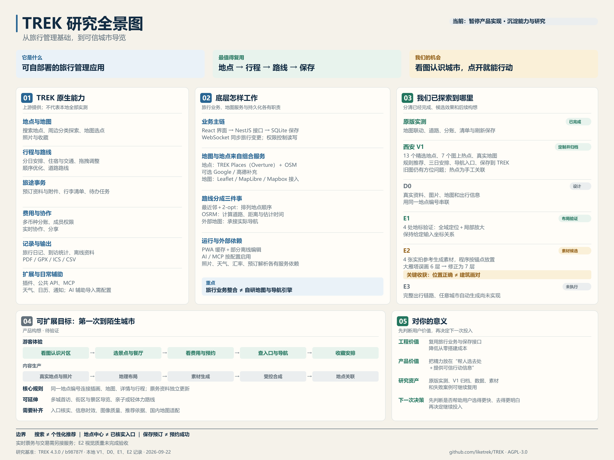

# 012 · TREK：旅行管理与城市导览研究

TREK 是可自行部署的旅行管理应用，整合地点、地图、分日行程、路线、预订资料、费用和协作。我们实测原版，再围绕“第一次去西安”制作长安初见 V1，研究真实坐标与参考照片如何支撑一张可信的城市导览图。后续可评估更成熟的图像选点与出行引导产品。

[返回总索引](../../README.md) · [上游仓库](https://github.com/liketrek/TREK) · [官方演示](https://demo.liketrek.com) · [公开研究总览](https://yydshly.github.io/0919_codex_project/012-trek/)

## 当前阶段与后续规划

**当前决定：暂停继续实现产品，转为研究能力与成果整理。** 以下原型和实验作为分析参考保留，可扩展目标不代表已决定继续开发。

- [一图看全：TREK 能力、原理、我们的探索与价值](assets/trek-research-overview-2026-09-22.png)
- [完整研究说明与证据入口](notes/trek-capability-overview.md)：区分上游原生、本地定制、实验候选和未来构想，涵盖地图／地点／路线／导航的分工及对个人产品探索的意义。
- [公开研究总览与网页入口](https://yydshly.github.io/0919_codex_project/012-trek/)：以本项目专门制作的全景图引导原版实测、西安 V1 摘要、D0、E1、E2；本机旧插画因公开使用范围待核实而不打包到远端。

2026-09-22 已将本版网页、现有能力、源码与图片资料、运行数据和截图冻结归档，作为后续分析与设计的对照。当前演示保持原样。

- [V1 存档与恢复说明](archives/2026-09-22-v1-185446/README.md) · [打开只读归档预览](http://127.0.0.1:15213/#atlas)
- [下一阶段项目规划](notes/xian-product-replan.md)：以真实地理数据与景观参考生成城市导览图，关联真实地点、地图、票价、预约和到达指引。此为规划，不代表新增能力已经实现。
- [技术探索设计 D0](design/2026-09-22-exploration/README.md) · [打开线上设计讨论页](https://yydshly.github.io/0919_codex_project/012-trek/design/2026-09-22-exploration/)：六步生成链路、地点关系与三个实验，关联 V1 研究摘要；旧图与完整交互仍在本机归档。E1 已有四点布局小样结果；新生成与票务能力仍待验证。
- [E1 地理布局实验](design/2026-09-22-exploration/e1/README.md) · [打开线上可操作对比](https://yydshly.github.io/0919_codex_project/012-trek/design/2026-09-22-exploration/e1/)：同一组真实坐标比较连续图与分区图，支持占位大小调节、故障检测和布局导出。与输入一致不等于建筑外形与导航可达性已验收。
- [E2 素材与合成实验](design/2026-09-22-exploration/e2/README.md) · [打开线上实拍与生成对照](https://yydshly.github.io/0919_codex_project/012-trek/design/2026-09-22-exploration/e2/)：5 次内置图像生成得到 4 张候选，保留大雁塔失败首版；实际素材按 E1 锚点放置，支持故障检测与记录导出。透明边缘和整体视觉质量尚待完善。

完整快照与校验后的压缩包保存在本机 `.local/backups/trek/2026-09-22-v1-185446/`；具体文件与恢复步骤见存档。原产品目标、研究与验证记录保留，后续实验另存版本。



## 实际交付

### 长安初见：西安定制体验

[打开一图识西安](http://127.0.0.1:5213/#atlas) · [融合设计说明](notes/xian-visual-product.md) · [产品目标与验收标准](notes/xian-product-goal.md)

原始 V1 图像和截图仅保存在本地归档；公开版请看[西安 V1 研究摘要](https://yydshly.github.io/0919_codex_project/012-trek/v1.html)。

- 以城景工坊原有西安 V2 图稿为主入口：7 个画面匹配热点、片区探索、缩放查看；图外补充餐厅、碑林与兴庆宫。
- 从图中选点进入真实资料、预约提示、实拍照片、行程与道路。图片热点位置不参与地理距离计算。
- 11 张有归属及许可的实拍照片：7 张景点照片、4 张明确标注“非门店出品”的菜品参考图；来源见 [图片清单](notes/xian-photo-sources.md)。
- 原景观图仍有部分方位待校正，作为研究插画复用；导航与道路以独立核实的坐标及地图服务为准。本轮未重绘或生成新城市图，也未实现任意城市自动生图。

地图、地点与行程的实现范围见下文；旧页面的完整视觉证据保留在本机归档。

- 13 个精选地点：9 个景点、4 个餐饮地点；默认首次到访、3 天、2 人、历史与美食偏好，支持带父母和亲子场景。
- 通过公开的规则给出推荐理由，选择地点后按地域安排三天；使用 Leaflet 与 OpenStreetMap 展示真实地图。
- OSRM 提供驾车和步行道路路线，显示距离与估计时间；高德入口负责把目的地交给外部地图导航。
- 本地适配服务调用原版 TREK 接口，创建和更新专用旅行、地点与每日安排，保存后重新读取原版数据，提供原版旅行链接。
- 前端定制、精选内容与规则排序由本项目实现；真正复用的后端是 TREK 的旅行、地点、日期和安排接口及 SQLite 持久化。它不是大模型个性化推荐。
- 不提供实时门票余量、营业状态或拥挤程度保证；游览与交通时长属于估计。陕西历史博物馆须自行预约，加入计划不代表预约成功。
- 地图瓦片和路线依赖外部服务。步行路线服务失败时应显示失败，不能用驾车路线或连点直线冒充步行道路结果。

### 京都旅行：上游原版实测

本机运行上游完整前后端；静态导览页展示真实操作截图、操作前后结果与原版入口。原版通过 React → NestJS → SQLite 工作，修改保存到服务端。原版地图与地点照片依赖外部服务。

- 原版实例：`http://127.0.0.1:3212/trips/2`，已有 3 天、11 个地点、3 位旅客、2 条预订、5 笔支出、7 件行李。
- 本机演示账户保存在被忽略的原版服务配置中；研究仓库与静态网页不发布登录凭据。
- 实测新增 3,000 JPY 午餐：总额 52,500 → 55,500，每人 17,500 → 18,500；阿青应还 Lin 12,500，小周应还 Lin 9,500。刷新后保存。
- 实测勾选充电宝：完成 3/7 → 4/7，刷新后保存。
- 真实京都坐标和在线底图；人物、费用、住宿、列车预订是场景样本，没有实际订单或支付。

以下是 `simulation.html` 辅助教学页的操作，不属于原版实测：

| 页面 | 可以实际操作的功能 |
| --- | --- |
| 行程与地图 | 切换三天行程；点击地点与地图标记联动；上移/下移；从示例地点库添加；运行最近邻 + 2-opt；撤销；导出当前行程文本 |
| 费用与分账 | 新增、删除示例费用；以人民币整数分均摊；实时计算已付、应承担、转账建议；导出 CSV |
| 行李清单 | 勾选物品；新增、删除；分配负责人；查看准备进度 |
| 技术原理 | 四条可逐步播放、暂停和点选的数据流程：实时协作、路线优化、离线重连、AI/MCP；提供固定提交的来源链接 |
| 使用场景 | 三种可切换场景：朋友出游、家庭/长期旅行、AI 旅行产品开发；解释收益、前提和边界 |

操作保存在当前浏览器 localStorage，可刷新继续或重置。相同来源下的其他标签页可通过 storage 事件更新；这不是 TREK 的多用户实时协作。示例人物、金额、旅行日期与住宿均为虚构。

## 本地预览

在仓库根目录启动长安初见；脚本同时确保原版 TREK 已运行：

```powershell
powershell -ExecutionPolicy Bypass -File projects/012-trek/scripts/start_xian.ps1
```

访问 [长安初见](http://127.0.0.1:5213)。适配服务仅绑定回环地址；读取本机配置完成 TREK 登录，浏览器不接收上游账号密码。它只操作带有本产品标记的专用旅行。运行状态和日志位于 `.local/xian-demo/`，不进入版本库。

适配服务验证不会创建测试旅行；在网页完成一次保存后，可加 `--saved` 验证从 TREK 重新读取的结果：

```powershell
python projects/012-trek/scripts/verify_xian.py
python projects/012-trek/scripts/verify_xian.py --saved
```

重启已安装的原版实例：

```powershell
powershell -ExecutionPolicy Bypass -File projects/012-trek/scripts/start_real.ps1
```

固定源码位于 `.local/trek-extracted/TREK-b98787f83698f3beee1b9a8475121c52f0caf07c/`，数据库在其中 `server/data/travel.db`，本地配置在 `server/.env`。这些运行文件不进入版本库。首次启动约需 90 秒。

首次安装复现：从上游固定提交下载源码；使用 Node 24.19，根目录运行 `npm ci`、`npm rebuild better-sqlite3`、`npm run build`；将 `client/dist/` 内容复制到 `server/public/`。在 `server/.env` 配置 `HOST=127.0.0.1`、`PORT=3212`、`NODE_ENV=production`、`COOKIE_SECURE=false`、`FORCE_HTTPS=false`、`APP_URL=http://127.0.0.1:3212`、`ALLOWED_ORIGINS=http://127.0.0.1:3212`、`DEFAULT_LANGUAGE=zh` 和初始管理员账户。管理员首次登录需要完成初始化。运行 `python projects/012-trek/scripts/seed_real.py` 可创建基础场景，重复运行会保留已有同名行程。网页中的原版链接目前对应本机实测行程 ID 2；其他安装应按实际返回 ID 更新。第五笔午餐、充电宝勾选由本次浏览器实测产生。

静态导览预览：

在仓库根目录执行：

```powershell
python projects/012-trek/scripts/build_web.py
python -m http.server 5212 --bind 127.0.0.1 --directory web
```

访问 `http://127.0.0.1:5212/012-trek/`。构建会整理公开研究首页、原版实测导览、西安 V1 摘要和 D0/E1/E2 实验网页；专用全景图作为引导。它排除旧城市插画、本机数据库、备份和凭据。长安初见完整交互仍在本机 5213 端口，静态站点不提供后端保存与道路查询。

核心算法检查：

```powershell
node projects/012-trek/scripts/verify.mjs
```

## 上游研究基准

| 项目 | 内容 |
| --- | --- |
| 仓库 | https://github.com/liketrek/TREK |
| 固定提交 | `b98787f83698f3beee1b9a8475121c52f0caf07c` |
| 上游提交日期 | 2026-09-20 |
| 研究日期 | 2026-09-22 |
| 上游许可证 | AGPL-3.0 |
| 上游主要栈 | React、TypeScript、Vite、Zustand；NestJS、SQLite、WebSocket；地图与 MCP 集成 |

TREK 是可自行部署的旅行管理应用。按天组织地点，管理预订与附件、费用与清单、多人协作，并提供日记、到访统计、插件和 MCP。部分模块需要管理员开启。

## 辅助教学模拟与真实能力的边界

本节只描述旧版 `simulation.html`。首页截图和本机 3212 端口是真实原版。未实测跨账号协作、AI/MCP 调用、离线冲突恢复；KItinerary 提取器未安装，文件自动解析未启用；已验证原版路线按钮：显示道路走向及 657 米/8 分钟、940 米/12 分钟、704 米/9 分钟等分段估计；不是实时交通承诺。

- 地图背景是原创地理示意，不是真实底图。地点使用经纬度，路线显示为直线；可通过外链查看 OpenStreetMap。
- 本页优化固定第一个地点，采用近似平面坐标距离、最近邻和 2-opt；不实现酒店锚点、定时/锁定停留点、营业时间或实时交通约束。
- 上游路线顺序优化使用坐标距离；OSRM 道路路线是后续不同步骤。优化不保证全局最优。
- 本页费用只实现人民币、三人均分和单付款人。上游还有自定义分摊、多付款人、多币种和汇率等功能。
- 本页导出为 TXT/CSV；上游还支持 PDF、GPX 与 ICS。没有把这些上游导出方式伪装成此页已实现功能。
- 预订卡是虚构示例，不解析真实文件、不购买机票、不预订酒店。上游通过 KDE Itinerary 解析，AI 为可选补充，保存前需要核对。
- 技术流程是教学动画，没有运行 SQLite、WebSocket、MCP 或大模型，也没有配置后端账号与 OAuth。
- 本页 localStorage 只做浏览器保存，没有实现 PWA 或真实离线请求队列。上游缓存使用 Workbox + IndexedDB/Dexie，离线编辑主要覆盖地点和行李清单。

## 对个人与开发者的价值

多人、长行程可减少资料分散和沟通成本；家庭出行更适合使用清单与离线资料；开发 AI 助手时可评估复用其业务模型、权限及 MCP 工具。简单的一日游可能不值得自行维护服务。主要在国内出行时，先验证地点搜索与导航质量；需要票务与交易时应使用相应服务。

修改上游并提供网络服务前，应阅读 AGPL-3.0 并评估提供相应源码的义务。

## 来源与许可

城市景观主图来自旧项目 `0913_codex_project/projects/009-city-landmark-map/assets/xian-macro-user-v2.png`，保留来源元数据至 `site/xian/atlas/source.json`。这是用户此前上传的研究样稿，本轮未改写成新生成成果；具体原始许可及外部发布范围仍待核实，本次只做本地整合，未部署。照片使用许可及署名保留于 `site/xian/photos.json`，页面详情与导览侧栏提供作者、来源和授权链接。

长安初见使用的 Leaflet 本地文件遵循 BSD-2-Clause，完整声明保留在 `site/xian/vendor/LICENSE`，构建时一并复制。OpenStreetMap 地图数据与瓦片保留地图署名；OSRM 路线查询依赖各服务实例，不代表提供实时路况。精选地点来源和核实信息随地点数据维护。

导览与辅助教学代码独立编写。`real-*.png` 为本机运行上游 TREK 时的实际截图，包含上游界面、标志与地图/照片；地图署名在截图中保留。上游源码依 AGPL-3.0 使用，固定提交链接见下文。TREK 名称用于识别研究对象，不表示官方合作。未向静态站点打包上游后端或本地数据库。

- [功能说明](https://github.com/liketrek/TREK/blob/b98787f83698f3beee1b9a8475121c52f0caf07c/README.md)
- [路线算法](https://github.com/liketrek/TREK/blob/b98787f83698f3beee1b9a8475121c52f0caf07c/wiki/Route-Optimization.md)
- [离线范围](https://github.com/liketrek/TREK/blob/b98787f83698f3beee1b9a8475121c52f0caf07c/wiki/Offline-Mode-and-PWA.md)
- [AI 文件导入](https://github.com/liketrek/TREK/blob/b98787f83698f3beee1b9a8475121c52f0caf07c/wiki/AI-Booking-Import.md)
- [MCP](https://github.com/liketrek/TREK/wiki/MCP-Overview)
- [费用管理](https://github.com/liketrek/TREK/blob/b98787f83698f3beee1b9a8475121c52f0caf07c/wiki/Budget-Tracking.md)
- [数据库实现](https://github.com/liketrek/TREK/blob/b98787f83698f3beee1b9a8475121c52f0caf07c/server/src/db/database.ts)
- [WebSocket 广播](https://github.com/liketrek/TREK/blob/b98787f83698f3beee1b9a8475121c52f0caf07c/server/src/nest/realtime/realtime.service.ts)

验证记录与维护说明见 [研究笔记](notes/README.md)。
