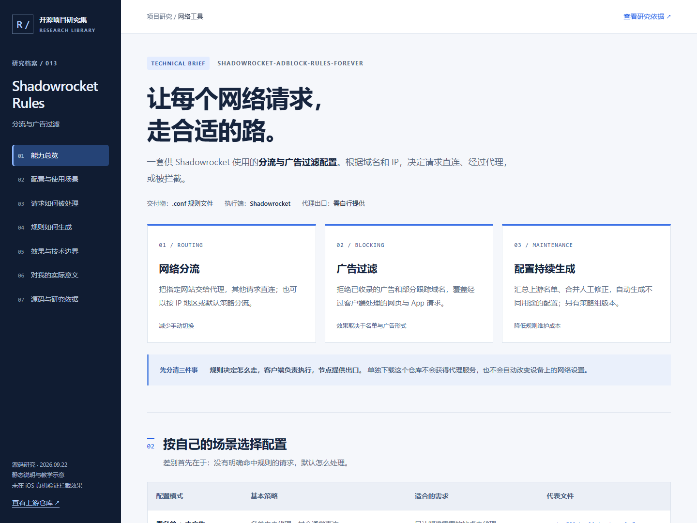
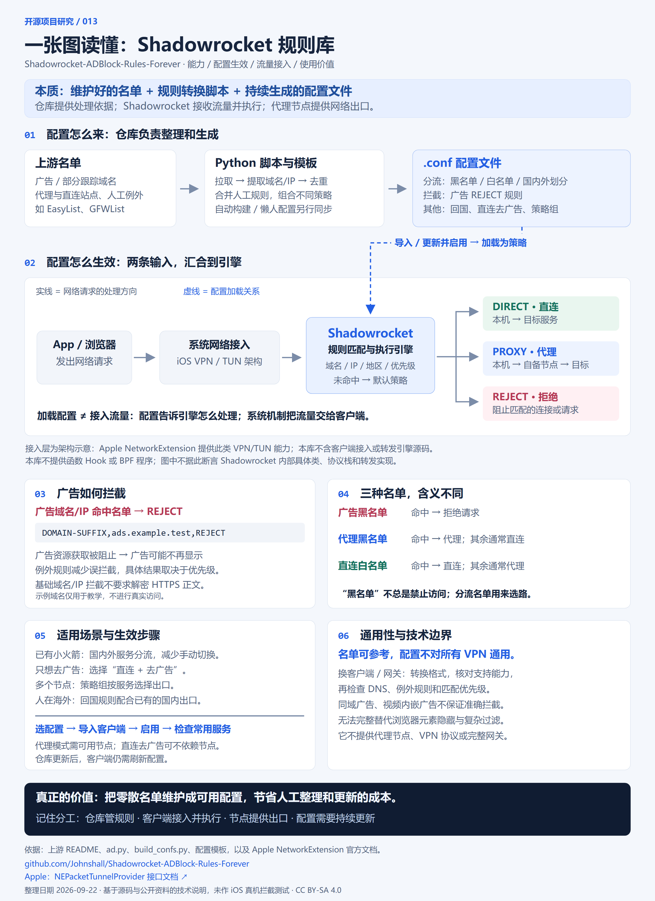

# 013 · Shadowrocket Rules · 分流与广告过滤

这个库把广告名单、代理黑名单与直连白名单整理成 Shadowrocket 的 `.conf` 配置。客户端加载配置后，根据目标域名或 IP 选择直连、代理或拒绝。仓库持续生成规则，主要价值是减少人工整理与维护；其他客户端可参考名单，但需要适配配置格式和匹配行为。

研究网页包含上次生成的能力引导图、配置对比、分流教学示意、生成流水线，以及固定版本的源码依据。

[返回总索引](../../README.md) · [上游仓库](https://github.com/Johnshall/Shadowrocket-ADBlock-Rules-Forever) · [网页源码](site/index.html) · [研究笔记](notes/README.md)

## 项目信息

| 项目 | 内容 |
| --- | --- |
| 研究日期 | 2026-09-22 |
| 上游 build 提交 | `ff8ecea54bb71deaab5ef13bfd466e7da03a50fa` |
| 上游 release 提交 | `1df281947ae906e6dd8440bb540eff11312aa74f` |
| 上游许可 | CC BY-SA 4.0，以上游 LICENSE 原文为准 |
| 上游技术 | Python、名单转换、配置模板、GitHub Actions |
| 展示页技术 | 原生 HTML / CSS / JavaScript；Python 标准库复制构建 |
| 验证范围 | 源码阅读与网页检查；未运行 iOS Shadowrocket 真机测试 |

## 页面截图



## 一图读懂能力与原理



[高清 PNG](assets/capability-overview.png) · [可缩放 SVG](assets/capability-overview.svg)

图中汇总了本次讨论形成的理解：仓库交付名单和配置；客户端加载配置；系统机制接入流量；引擎按规则决定直连、代理或拒绝。还区分广告黑名单与分流黑白名单，说明生效步骤、适用场景和其他客户端的适配边界。

图中 VPN / TUN 接入属于架构说明，参考 [Apple NetworkExtension 文档](https://developer.apple.com/documentation/networkextension/nepackettunnelprovider)；本仓库不包含 Shadowrocket 客户端引擎源码，不能据此确认其内部具体类或转发实现。

矢量图由 `scripts/build_overview.py` 生成，构建网页时自动更新；PNG 为矢量图的高清导出。

## 核心结论

- 仓库提供配置，Shadowrocket 执行，代理节点提供出口，三者职责不同。
- 通过域名、IP 与地区规则决定 DIRECT、PROXY 或 REJECT。
- 自动广告转换主要提取整域规则，不包含完整的浏览器元素隐藏、条件规则和 URL 过滤能力。
- 模板中手工代理例外可能位于广告规则前，实际效果受优先级影响。
- 只去广告可以使用直连版本；访问代理出口的能力仍需要已有节点。
- 定期构建不等于手机自动同步，也不保证规则实时有效。
- README 的北京时间 8:00 描述与核对工作流的 `0 23 * * *`（UTC，对应北京时间 7:00）不一致。页面如实呈现，不承诺准确发布时间。

## 页面内容

1. 能力总览：网络分流、广告过滤、配置生成。
2. 配置对比：黑名单、白名单、国内外划分、直连、代理、回国、仅广告、策略组。
3. 请求处理示意：5 个模式 × 4 类固定样本，显示匹配条件和结果。
4. 技术流水线：名单下载、清洗、人工例外、模板组装、发布与客户端更新。
5. 效果边界：同域广告、视频广告、HTTPS 解密、误拦截、隐私和性能。
6. 个人价值：已有小火箭、只去广告、Windows 用户与工程学习者。
7. 固定提交的源码依据与研究范围。

教学示意使用 `.test` 保留域名，不访问示例目标，不检测或更改本机网络。它只演示无冲突样本，不实现 Shadowrocket 引擎。

## 本地构建与预览

在研究仓库根目录运行：

```sh
python projects/013-shadowrocket-rules/scripts/build_web.py
python -m http.server 5191 --bind 127.0.0.1 --directory web
```

打开 http://127.0.0.1:5191/013-shadowrocket-rules/ 。页面无第三方前端依赖，不需安装上游软件。可发布文件位于 `web/013-shadowrocket-rules/`，继续使用研究集现有的 GitHub Pages 工作流。公网地址仅在实际发布并验证后填写到 project.json。

## 来源与许可

上游作者包括 h2y、Moshel、Johnshall，具体署名与引用名单见上游仓库。页面基于上游说明及源码进行了中文整理与解释，衍生技术说明采用 CC BY-SA 4.0。未复制上游完整配置、证书或代理节点。上游 LICENSE 的 API 分类为 NOASSERTION，但原文明确写明 Creative Commons Attribution-ShareAlike 4.0 International，故按原文记录。
