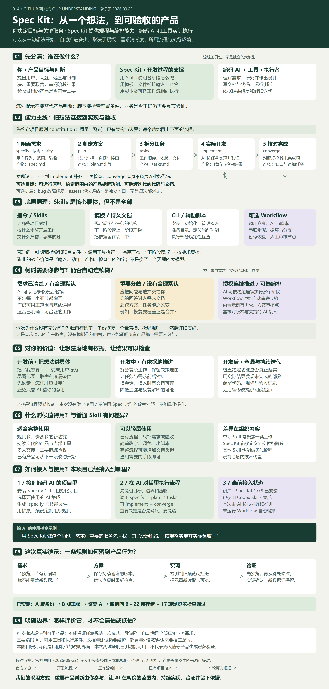
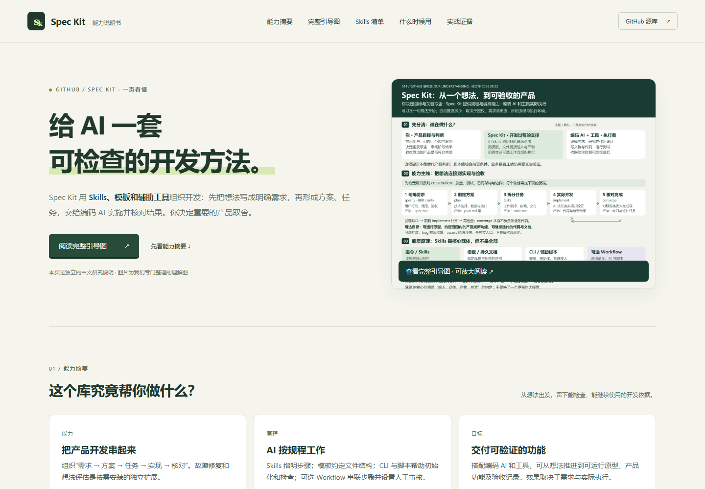

# 014 · Spec Kit · 看懂 AI 开发流程

用中文交互网页说明 GitHub Spec Kit 的能力。通过个人记账、图片整理、订单导出三个案例，展示一句想法怎样变成需求、方案、任务和验收依据。

[在线阅读能力摘要与完整引导图](https://yydshly.github.io/0919_codex_project/014-spec-kit/) · [返回总索引](../../README.md) · [上游仓库](https://github.com/github/spec-kit) · [网页源码](site/index.html) · [研究依据](notes/README.md)

## 新增：真实实战

第二次实战已交付 **研库 · 定制研究工作台**：定制空间 → 搜索比较16项真实研究 → 写个人结论 → 安排任务 → 导出成果。使用本地SQLite持久保存，并提供实际开发产物与验收记录。[从定制开始](http://127.0.0.1:5215/) · [真实制作过程](http://127.0.0.1:5215/process) · [研究展示页](http://127.0.0.1:5214/014-spec-kit/workbench.html) · [运行与源码](practice/research-workbench/README.md)。

已实际安装 Spec Kit 1.0.9 并初始化 Codex 技能项目，由 Codex 按生成的技能完成一个开源项目收藏夹。支持新增、搜索、状态、刷新保存、全量 JSON 导出和删除撤销。

[实际流程网页](site/live.html) · [成品源码](practice/resource-shelf/app/index.html) · [执行记录](notes/live-run/README.md) · [真实需求](practice/resource-shelf/specs/001-resource-shelf/spec.md) · [实际验收](notes/live-run/verification.json)

运行原构建命令后，访问 <http://127.0.0.1:5214/014-spec-kit/live.html> 查看过程，或 <http://127.0.0.1:5214/014-spec-kit/app/> 直接试用。

## 核心认识

你决定目标和边界；Spec Kit 提供流程指令、模板与辅助脚本；接入的 AI 编程工具实际理解需求、写文档、修改代码和运行检查。

Spec Kit 的价值是让工作有明确输入、产物与检查依据。它不会单靠安装就生成完整产品，也不能保证需求正确或代码没有缺陷。

## 我们的理解总览图

[](https://yydshly.github.io/0919_codex_project/014-spec-kit/overview.html)

核心以 Skills 等指令承载开发规程，模板和脚本辅助，AI 与工具实际执行。Skill 的价值是明确每一步的输入、动作、产物与检查，让需求、方案、任务、实现与验收前后对应。对持续迭代、规则复杂、需要交接的项目更有价值；简单修改可以直接执行，也可只借鉴模板和验收习惯。

与 Frontend Design Toolkit、baoyu-design、ASu-skills 等流程型 Skill 没有本质技术代差，主要差异是专业领域和流程衔接。Spec Kit 更侧重软件需求及完成度。我们的实测发现并修复了名称静默截断问题，18项浏览器检查通过，但未做效率或质量提升的对照实验。本图及展示网页是原创研究产物，并非上游原生 UI。

[放大阅读](https://yydshly.github.io/0919_codex_project/014-spec-kit/overview.html) · [高清 PNG](assets/understanding-map.png) · [矢量 SVG](assets/understanding-map.svg) · [实际检查记录](notes/live-run/convergence.md)

## 网页内容

- 用图解分清用户、Spec Kit、AI 编程工具的职责。
- 三种场景 × 五个流程步骤；查看每一步的示例产物与用户决策。
- 能力与边界对照；解释测试需要明确约定和真实执行。
- 初始化、阶段指令、文件上下文及检查循环的原理。
- 四种任务选择，查看适用性和建议起点。
- 当前上游提供的故障修复、想法评估两类可选扩展。
- 官方来源链接与研究范围说明。

## 研究信息

| 项目 | 内容 |
| --- | --- |
| 研究日期 | 2026-09-22 |
| 上游提交 | `b9e7389d1414cfefe3964917a7ca48cd99503815` |
| 上游许可 | MIT，以原仓库 LICENSE 为准 |
| 展示页 | HTML / CSS / JavaScript，无第三方前端依赖 |
| 验证范围 | 源码与文档、说明页交互；Spec Kit 1.0.9 实际初始化和辅助脚本；收藏夹实际浏览器验收 |
| 未执行 | 原三个教学案例对应的业务软件；本次仅实际开发并运行收藏夹 |

原说明页的三个切换案例仍为教学示例；新增真实实战页明确展示实际文档、CLI 日志、测试报告及可操作成品。应用的用户数据保存在当前浏览器，没有上传接口、远程字体或分析服务。

## 本地构建与预览

在研究仓库根目录运行：

```sh
python projects/014-spec-kit/scripts/build_web.py
python -m http.server 5214 --bind 127.0.0.1 --directory web
```

打开 <http://127.0.0.1:5214/014-spec-kit/>。也可以直接在浏览器打开 `site/index.html`，交互无需网络。返回研究集的导航以 `web/` 构建后的部署结构为准。

构建结果位于 `web/014-spec-kit/`，并通过现有 GitHub Pages 工作流发布。公开站点提供研究说明、专门绘制的引导图和匿名验收记录；研库产品本身仍在本机运行。

## 页面截图



## 验证

页面验证脚本：`scripts/verify.cjs`。运行时通过 `PLAYWRIGHT_MODULE` 指定已有 Playwright 模块路径，可用 `SPEC_KIT_PREVIEW_URL` 覆盖预览地址。

验证覆盖全部 15 个案例步骤、下一步循环、四种适用性选择、技术细节展开、键盘操作、移动端与桌面端溢出检查和页面脚本错误。结果写入 `notes/verification.json`。


## 实战代码许可

初始化生成的 Spec Kit 技能、脚本和模板来自官方发行包，保留 [MIT 许可证](practice/resource-shelf/SPEC-KIT-LICENSE)。本次应用代码和中文说明由 Codex 根据任务编写。

### 研库第二轮功能迭代：备份恢复

[真实开发阶段](http://127.0.0.1:5215/restore-build) · [独立可操作演示](http://127.0.0.1:5217/restore)。本轮规格/方案/任务位于practice/research-workbench/specs/002-restore-backup；从A版备份、B版当前记录演示只读预览、事务恢复与撤销，实际报告位于该产品evidence/restore/。


### 理解总览修订：职责、交互与接入

[一张图看懂完整能力](http://127.0.0.1:5214/014-spec-kit/overview.html)已整合本次讨论：三方职责、开发流程、Skills/模板/脚本/可选Workflow、合理默认与关键澄清、价值与适用场景、既有项目接入、真实验收及边界。说明我们按Skills自主推进的演示，不等于证明Workflow无人值守产品生成。图和开发过程页互相链接；可按9个章节定位、放大、下载高清PNG或打开可缩放SVG。

编辑源：scripts/build_understanding.py。生成：python scripts/build_understanding.py，然后运行scripts/render_understanding.cjs导出PNG并验证文字边界、桌面/手机页面、缩放与章节导航。图中22/17检查数从真实报告读取。


### 2026-09-24 · 静态能力摘要与公开证据

入口页改为专用理解图引导，先说明库的能力、原理、10个实际安装 Skills 的用途、使用时机和个人价值，再展开原有教学案例。完整图可放大阅读；网页为可发布的静态内容，精选公开证据放在 `web/014-spec-kit/evidence/restore/`。真实研库服务保留为本机演示，公网不运行其数据库或恢复接口。
