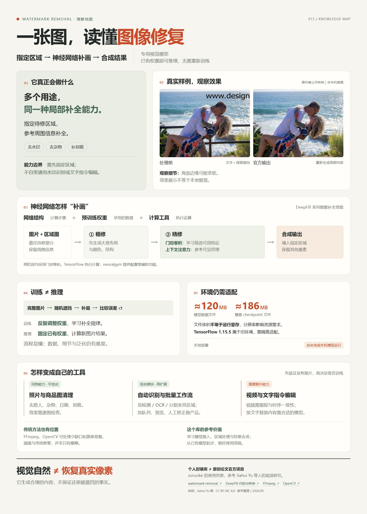

# 015 · Watermark Removal · 图像修复原理实验室

用中文交互网页说明 [zuruoke/watermark-removal](https://github.com/zuruoke/watermark-removal) 的能力、使用场景、底层实现原理和实际价值。

这是一份源码研究与效果展示页面。新增四组 **DeepFill 原作者发布的真实样例**，可拖动对比原图与模型输出、切换遮罩输入，并查看原尺寸文件。它们来自本库引用的底层方法，**不是 zuruoke/watermark-removal 的本地实测**。原有插画和注意力数值仍标记为教学示意；未在本地训练或运行模型。

## 研究信息

| 项目 | 内容 |
| --- | --- |
| 上游作者 | Chimzuruoke Okafor / zuruoke |
| 核对提交 | `902dc1a268d29d50d291ac2a30150abb9574311a` |
| 研究日期 | 2026-09-22 |
| 上游技术 | Python、TensorFlow 1.15.5、neuralgym、OpenCV |
| 展示技术 | 原生 HTML / CSS / JavaScript / Canvas，无第三方前端依赖 |
| 上游许可 | 核对树中未发现 LICENSE；未据此推定代码或权重可自由商用 |
| 验证范围 | 上游源码阅读、本地网页与交互验证；不含模型画质、速度或训练复现 |

## 页面内容



- 首页突出三个结论：专用图像补全、使用预训练权重、视觉自然不保证像素真实。
- 一张 1600 × 2240 PNG 知识总览图，网页内可查看与下载；海报源文件提供原生高清导出按钮。
- 神经网络结构、训练参数、输入相关的门值/注意力权重与 TensorFlow / neuralgym 的职责对照。
- 卷积、特征、空洞卷积、sigmoid、softmax、损失、梯度及 GAN 的可展开解释。
- 预训练推理、继续训练与从零训练的区别，以及训练难点。
- FFmpeg delogo / removelogo、OpenCV inpaint 与神经网络的场景比较，明确尚未同图实测。
- 模型文件约 120 MB、完整检查点约 186 MB，说明文件大小与运行显存的区别。
- 本机环境检查快照、旧依赖适配、部署路径、静态展示与实际推理服务的区别。
- 六类可参考扩展、额外模块与验收要求，以及商品背景清理台的具体工作流程。
- 个人项目封装与原论文作者成果的区别，以及学习、原型和产品开发的实际价值。

- 六步可点击修复示意：输入、遮罩、隐藏区域、粗修、精修、合成。
- 四组官方真实照片样例：文字水印及栏杆清理、毕业照路人移除、沙滩多区域人物移除、合影大面积人物移除。
- 单图、批处理、通用修复扩展与默认模板限制。
- 两阶段网络图及结构生成 / 上下文注意力分支。
- 三种纹理的注意力权重教学示例。
- 门控卷积滑杆与特征乘积计算。
- 训练与推理切换、L1 损失与 SN-PatchGAN 的区别。
- 使用场景、部署成本与固定提交的源码链接。

## 核心结论

1. 默认入口依赖预设遮罩，未实现通用水印检测。
2. 当前只附带 iStock 横图遮罩，主入口检查约 ±5% 的宽高比范围。
3. 生成式修复是预测内容，不保证恢复真实原像素。
4. 第一阶段粗修，第二阶段融合结构生成和上下文注意力；主要卷积使用可学习门控。
5. 训练代码使用完整图像和随机缺损遮罩；日常推理加载预训练权重，只运行生成网络。
6. 旧环境、外部权重、遮罩制作和输出检查均会产生实际使用成本。

## 真实样例来源

来源为 [JiahuiYu/generative_inpainting](https://github.com/JiahuiYu/generative_inpainting/tree/3a5324373ba52c68c79587ca183bc10b9e57b783/examples/places2)，核对提交 `3a5324373ba52c68c79587ca183bc10b9e57b783`。该项目为 Contextual Attention / Gated Convolution 的官方实现，仓库按 CC BY-NC 4.0 提供内容，许可原文与署名说明随样例保留。

共保留 case1–case4 的 raw / input / mask / output 十六张原始 PNG，未重绘、修饰或替换像素。来源、尺寸和逐文件 SHA-256 见 [样例清单](site/samples/manifest.json)，详细署名见 [ATTRIBUTION.md](site/samples/ATTRIBUTION.md)。展示端只做缩放与分界线裁切。

第一组含真实文字水印移除，其余三组是物体移除。样例证明的是官方方法在这些指定输入上的结果，不能据此推断封装库在任意水印上的成功率、自动检测能力或性能。页面保留可见的砖纹模糊、沙地纹理变化等局限说明。

## 网页验证

- 桌面 1280 像素与手机 390 像素宽度下检查，无页面横向溢出。
- 六步切换与前后按钮通过；最后一步禁用下一步。
- 纹理选择会更新目标、说明及权重。
- 门值 0 / 1 对应输出 0.00 / 0.80，初始 0.65 对应 0.52。
- 训练与推理切换、折叠说明和内部锚点通过。
- 四组官方样例切换、原图 / 遮罩输入对照、滑杆两端、三图展开通过。
- 十六张本地 PNG 与上游下载文件逐字节相同，构建输出保留相同 SHA-256。
- JavaScript 语法检查通过，浏览器未报告警告或错误。
- 全库索引检查受到既有其他项目元信息缺失影响，独立子项目与静态页面构建不受影响。

## 构建与预览

在研究仓库根目录执行：

```sh
python projects/015-watermark-removal/scripts/build_web.py
python -m http.server 5193 --bind 127.0.0.1 --directory web
```

访问 http://127.0.0.1:5193/015-watermark-removal/ 。页面也可直接打开 `site/index.html` 阅读。输出位于 `web/015-watermark-removal/`，已接入研究集网页入口与现有 Pages 构建流程；本次仅完成本地制作，未发布到公网。

### 知识海报与导出

海报源文件：`site/understanding-poster.html`；成品图片：`site/understanding-summary.png`。在本地 HTTP 预览打开海报，点击“生成高清 PNG”，再点击“下载 PNG”。导出使用内嵌样例图片的 SVG foreignObject 与 Canvas，固定 1600 × 2240，不调用模型或外部生成服务。修改海报内容后需重新导出 PNG 并重新构建，以同步主页面预览。

本次新增内容已检查桌面 1280px 与手机 390px 布局、内部锚点、术语展开、样例切换和训练/推理切换。PNG 已检查无截断或拼接重复，原始样例仍保持不变。

## 索引说明

创建时已有两个 011 项目，且 012 / 014 的元信息尚未齐备，现有 `scripts/project.py` 因全库校验无法直接创建或同步。按照已有目录最大编号新增 015，保留其他项目和编号不动。待其他项目元信息整理后执行 `python scripts/project.py sync`，即可把本项目纳入自动生成的根 README 索引。
