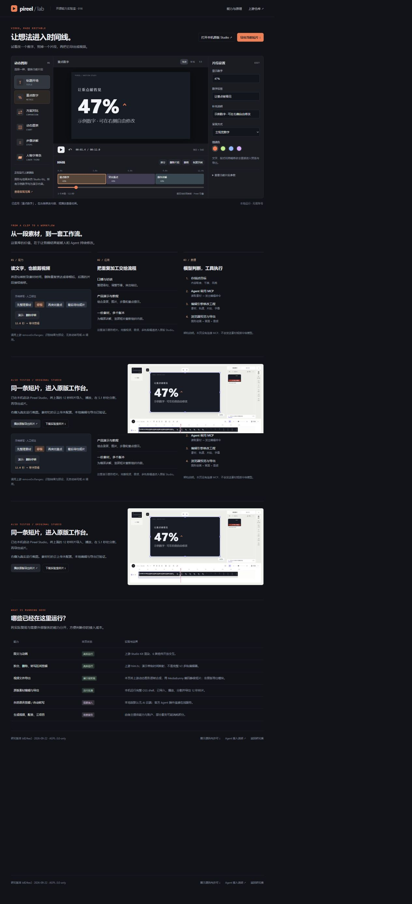
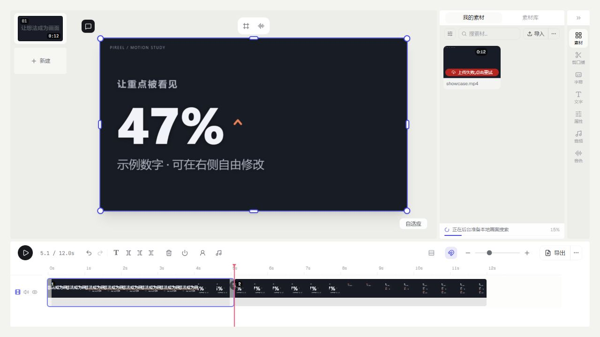

# 016 · Pireel · AI 视频剪辑能力实验室

[在线能力页](https://yydshly.github.io/0919_codex_project/016-pireel/) · [全景图](https://yydshly.github.io/0919_codex_project/016-pireel/pireel-overview.svg) · [发布验证记录](notes/publication.md)

Pireel 把视频、图片、音频和动态图文组织为可编辑时间线，完成裁切、叠加、混音与导出；工程记录编辑决定，浏览器绘制并编码成片。接入 Agent 后，AI 也能修改同一工程。对我们既是剪辑工具候选，也是开发 AI 视频编辑产品的实现参考。

研究页以能力摘要和全景图为引导，继续说明依赖、实现原理与使用场景；Blinko 的 45 秒剪成 28 秒案例用于验证原版的实际效果。

## 一张图理解 Pireel

[高清 PNG（3240×5280）](assets/pireel-overview.png) · [可无损放大的 SVG](assets/pireel-overview.svg)

六部分梳理素材与效果、人和 AI 的分工、编辑与合成技术、原版实测案例、使用及学习价值、适用场景与验证边界。图中区分已实测能力和未接入服务；不是把所有功能标为已验证。制作依据见 [图示说明](notes/overview.md)。

## 真实场景演示

页面首屏提供剪前素材与剪后成片切换，四个步骤按钮可直接跳到对应内容。

- 输入：真实 Blinko 部署截图 + 预先在本机合成的中文解说，45 秒。
- 原版 Pireel 实际操作：删除开头 9 秒和结尾 8 秒；添加 4 段动态文字；保留声音；导出 28 秒 MP4。
- [剪前素材](assets/story/before.mp4) · [原版导出成片](assets/story/after.mp4) · [实测过程](notes/real-scenario.md)
- 未接入 AI 自动剪辑、自动转写或云配音。截图取景变化和语音属于预先准备的输入，Pireel 完成本次裁切、文字合成与导出。

原有组件实验室收进页面下方的折叠区，可继续调参和导出。

[返回总索引](../../README.md) · [上游仓库](https://github.com/pireel/pireel) · [Agent 插件](https://github.com/pireel/pireel-agent)

## 本次交付

- 6 类实际运行的上游图形组件：标题、数字、对比、图表、步骤、人物字幕条。
- 可编辑文字、数字、图表数据、布局、强调色，切换横屏、竖屏与方形画幅。
- 12 秒可播放示例；拆分、删除、撤销、空时间线恢复。
- 基于上游时间映射的转写区间删除示例：12 秒缩短到 10 秒。
- 浏览器逐帧导出静音 MP4；不支持 H.264 时尝试 VP9/WebM。
- 能力、场景、架构与服务边界说明；原始组件源码及许可下载。

本页调用真实库代码，但不是完整 Pireel Studio。没有接入大模型、MCP、自动语音识别或云服务。时间线演示采用上游 `trim.ts` 的单轨裁切模型，不冒充完整 V2 多轨工程。

## 截图与样片



[查看已导出的 12 秒样片](assets/showcase.mp4) · [查看导出画面](assets/export-frame.png)

样片为浏览器实际导出，H.264、960×540、24 fps、288 帧、12 秒，无音频。数字为演示内容，不是产品效果统计。

## 项目信息

| 项目 | 内容 |
| --- | --- |
| 上游 | https://github.com/pireel/pireel |
| 固定 Commit | `b824ee23ff1667c45232930366cf1ef5c85318c4` |
| 研究日期 | 2026-09-22 |
| 上游许可 | AGPL-3.0-only；独立 Agent 插件为 Apache-2.0 |
| 展示层 | Vite、JavaScript、GSAP、MediaBunny |
| 实测环境 | Windows、Node.js 22.15.0、Codex 内置 Chromium 浏览器 |

## 本地运行

在本目录执行：

```sh
npm ci
npm run dev
```

开发入口为 `http://127.0.0.1:5191/`。如果已有演示集预览占用该端口，先关闭该预览，或为开发服务另选端口。

构建静态演示：

```sh
npm run build:web
```

输出到仓库 `web/016-pireel/`。从仓库根目录启动整个演示集：

```sh
python -m http.server 5191 --bind 127.0.0.1 --directory web
```

打开 `http://127.0.0.1:5191/016-pireel/`。请通过 HTTP 访问，直接双击 HTML 无法正常加载模块。

## 实现与原理

1. `vendor/studio-kit/` 保留固定版本上游源码。组件接收结构化参数，输出 HTML 与 GSAP 时间线；本页提供编辑表单和运行容器。
2. `vendor/studio-engine/trim.ts` 保留原始文件。拆分、删除及语句区间裁切直接调用这里的函数。
3. 展示层持有片段数组，源时间经过上游映射后驱动每一帧图形动画。撤销为本页保存的操作前快照。
4. 导出属于本次编写的展示层：冻结工程快照，按 24 fps 定位上游动画，将 HTML 经 SVG foreignObject 栅格化到 Canvas，再由 MediaBunny 编码。没有直接使用原版 `client-export.ts`。
5. 下载的 JSON 是 `pireel-lab-demo-v1` 实验格式，不能作为 Pireel V2 工程导入。

## 完整原版与 AI 的边界

完整 Pireel 提供多素材、多轨、字幕、音频和画布编辑。本地 OSS shell 默认通过 `unavailableProviders()` 关闭未配置的 AI 与云端能力。要体验自然语言剪辑，需要自行接入能力提供方，或使用官网及其官方 Agent 插件。

本次已启动完整原版：`http://127.0.0.1:5192/`。已把本页导出的 12 秒样片导入原版素材栏、插入画面、播放，并在约 5.1 秒处分割为两个片段，再通过原版导出模块生成 [原版导出样片](assets/studio-export.mp4)。两个成片均为 H.264、960×540、24 fps、288 帧、12 秒。



原版源码位于仓库中被忽略的 `.local/pireel-source/pireel-b824ee23ff1667c45232930366cf1ef5c85318c4/`。重新启动时在该目录执行：

```sh
npx --yes pnpm@9.12.0 --filter @pireel/studio-oss-shell dev --host 127.0.0.1 --port 5192 --strictPort
```

本地素材可以播放和编辑；素材栏的云上传显示失败，未配置的账户与云服务不在本次复现范围内。自动画面搜索模型仍在后台下载。本页能力实验室不依赖这些服务。

## 对当前研究集的意义

与 Video Shotcraft 的动效素材复用相比，Pireel 值得关注的是“Agent 可修改的剪辑工程”；与 VideoCaptioner 的字幕与配音工作流相比，Pireel 覆盖画布、时间线及图形表达。适合验证口播整理、产品演示和一份素材多版本的生产流程。

本页验证了组件渲染、裁切数学与图形成片这条链路，并验证了原版本地导入、播放、分割和导出；尚未验证真实口播的 AI 编辑质量、复杂多轨工程和完整自托管服务。

## 来源与许可

- 上游复制文件：`packages/studio-kit/src/` 和 `packages/studio-engine/src/trim.ts`，固定为上表 Commit，未修改这些源文件。
- 上游全文许可及第三方声明在 [vendor/LICENSE](vendor/LICENSE) 与 [vendor/THIRD_PARTY_NOTICES.md](vendor/THIRD_PARTY_NOTICES.md)。
- 本展示源文件按 AGPL-3.0-only 提供；GSAP、MediaBunny、Vite 等依赖遵循各自许可。
- 静态输出提供 `source.zip`，包含本展示、对应上游源文件、锁定文件和许可，方便查看与重建。
- 操作记录与验证结果见 [notes/README.md](notes/README.md)。
