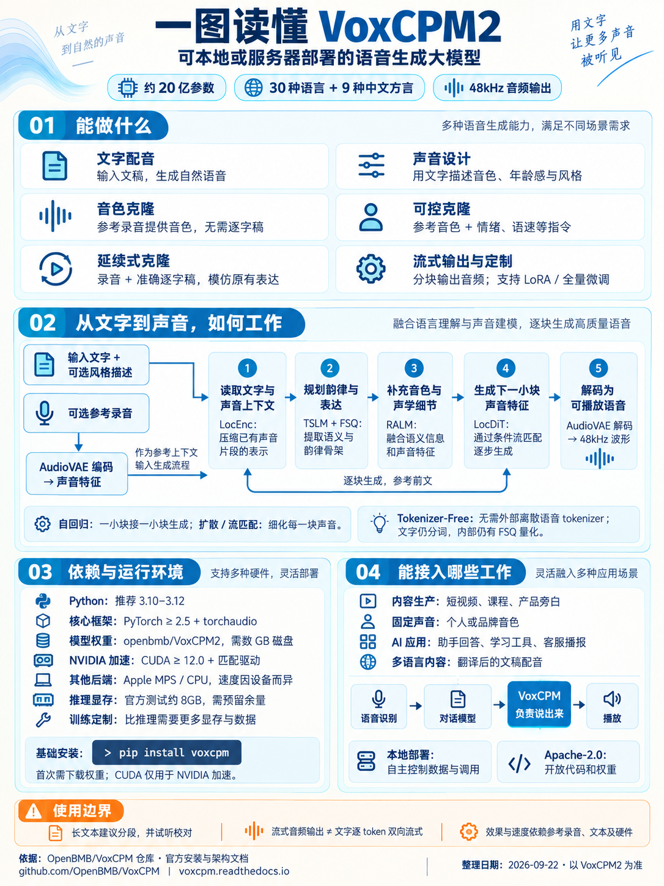

# 017 · VoxCPM2 · 本地语音生成模型研究



[在线阅读研究页](https://yydshly.github.io/0919_codex_project/017-voxcpm/) · [上游项目](https://github.com/OpenBMB/VoxCPM) · [模型架构文档](https://voxcpm.readthedocs.io/en/latest/models/architecture.html)

VoxCPM2 是 OpenBMB 发布的可自部署文本转语音模型。给它文字，它生成语音；还可以提供声音描述来设计新音色，或提供参考录音来克隆音色。官方称其支持 30 种语言、9 种中文方言和 48 kHz 输出。仓库同时提供推理、流式音频输出、LoRA 与全量微调代码。这里讨论的是 VoxCPM2；旧版 VoxCPM 与 VoxCPM1.5 的能力和资源需求不同。

## 它能解决什么问题

| 能力 | 具体用途 |
| --- | --- |
| 多语言文字配音 | 为文章、课程、产品介绍生成旁白 |
| 声音设计 | 用自然语言描述目标音色与说话风格，无需参考录音 |
| 参考音色克隆 | 用短录音提供音色，无需逐字稿；可另用文字控制情绪和语速 |
| 延续式克隆 | 同时提供录音和准确逐字稿，更紧密地延续原录音的表达 |
| 流式音频输出 | 逐块返回生成的音频，供播放器边收边播 |
| 模型定制 | 用 LoRA 或全量微调适配说话人、风格或领域 |

对话助手可以把 VoxCPM 用作最后的语音输出环节：语音识别取得用户问题，对话模型形成回答，VoxCPM 把回答读出来。它本身不负责对话推理、语音识别或翻译。

## 底层原理

**文字与可选参考录音 → 连续声音特征 → 逐块生成 → AudioVAE 解码 → 音频波形。**

1. AudioVAE V2 将参考录音编码成连续潜在特征；局部编码器将相邻帧组成声音块，降低语言模型处理的序列长度。
2. 基于 MiniCPM 的文本语义语言模型结合文字与已有声音上下文，形成语义和韵律信息；内部 FSQ 量化层使这个高层表示更稳定。
3. 残差声学语言模型补充音色与细节；局部扩散 Transformer 通过条件流匹配生成下一块连续声音特征。
4. 生成过程逐块重复，AudioVAE V2 再将特征解码为最高 48 kHz 波形。

“Tokenizer-Free”指**不依赖外部离散语音 tokenizer**，并不意味着文字不分词或模型内部没有量化结构。VoxCPM2 新增独立的参考音频通道，使音色参考与说话风格指令更容易分别控制。[官方架构说明](https://voxcpm.readthedocs.io/en/latest/models/architecture.html) · [VoxCPM2 技术报告](https://arxiv.org/abs/2606.06928)

## 运行条件与边界

- 官方安装说明推荐 Python 3.10–3.12、PyTorch 2.5 及以上；安装包还包含 torchaudio 等依赖。模型权重需额外下载，占用数 GB 磁盘。
- NVIDIA GPU 加速使用 CUDA 12.0 及以上；也可选择 Apple MPS 或 CPU 推理，速度取决于设备。仓库所列 VoxCPM2 推理显存约 8 GB，是指定条件下的参考值，应留余量。
- LoRA 和全量微调需要录音与准确文字，并比普通推理需要更多显存。官方训练文档在指定批量配置下分别给出约 20 GB、40 GB 的估算。
- 长文稿应按段生成并试听校对；干净的 5–30 秒参考录音通常更利于保持音色。支持流式**音频输出**，目前不支持文字逐 token 到达、音频同时持续生成的双向流式输入。
- 声音设计与可控克隆可能随运行而变化，不能仅凭 48 kHz 采样率推断听感或音色一致性。

[安装说明](https://voxcpm.readthedocs.io/en/latest/installation.html) · [使用指南](https://voxcpm.readthedocs.io/en/latest/usage_guide.html) · [微调指南](https://voxcpm.readthedocs.io/en/latest/finetuning/finetune.html)

## 对我们的意义

目前没有必须上线的配音或声音克隆需求，因此不需要为 VoxCPM 单独建设产品或投入模型训练。它适合作为**可自部署的语音输出备选组件**：当内容制作、AI 助手或多语言产品需要固定音色与可控配音时，先用实际文稿和参考录音做小样，再判断准确性、自然度、延迟和维护成本。若目标是研究语音模型，连续潜在空间、语义与声学分层、自回归加局部流匹配是值得进一步学习的实现。

## 本次验证范围

2026-09-22 至 2026-09-23 核对了上游仓库、官方文档、技术报告和核心推理代码；制作并检查了本研究页。**没有在本机下载或运行 VoxCPM2 权重，没有实测声音质量、显存或速度。** 网页由 GitHub Pages 静态托管，不提供在线语音合成服务。上方图片沿用本次讨论中的汇总引导图；具体条件与结论以本页文字和上游文档为准。

## 页面构建

在本研究集仓库根目录运行：

```sh
python projects/017-voxcpm/scripts/build_web.py
python -m http.server 5193 --bind 127.0.0.1 --directory web
```

随后打开 `http://127.0.0.1:5193/017-voxcpm/`。页面源码在 `site/`，发布文件在 `web/017-voxcpm/`，封面与页面主图均使用 `assets/overview.png`。
