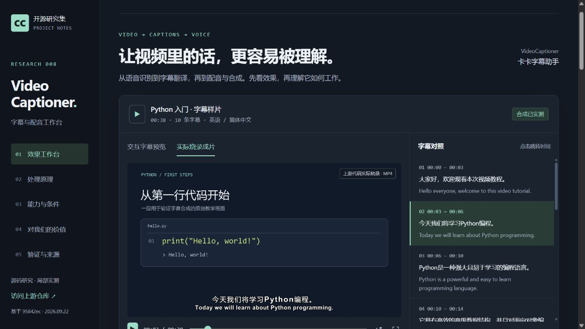

# 008 · VideoCaptioner · 字幕与配音工作台

VideoCaptioner（卡卡字幕助手）把视频或录音中的讲话识别成带时间戳的字幕，再断句、校正、翻译、配音和合成视频。它接入现成的语音识别引擎、大语言模型或翻译服务、语音合成服务，再用 FFmpeg 处理音视频；自己的主要工作是串起步骤，维护文字与时间轴的对应，校验模型结果并交付文件。我们可以复用这些流程，也可以自行接入本地模型；基础软件包本身不提供训练好的识别、理解或配音能力。

[返回项目索引](../) · [上游仓库](https://github.com/WEIFENG2333/VideoCaptioner) · [在线研究页](https://yydshly.github.io/0919_codex_project/008-videocaptioner/) · [本地网页](http://127.0.0.1:5188/008-videocaptioner/) · [验证记录](notes.md)

## 研究版本与范围

| 项目 | 内容 |
| --- | --- |
| 研究日期 | 2026-09-22 |
| 固定上游提交 | `95842ecb5618c0b6a548a336bdfb0eb859bdb501` |
| 上游许可 | GPL-3.0，复制的素材附上游 LICENSE 与固定版本来源 |
| 上游实现 | Python、PyQt5、语音识别引擎、OpenAI 兼容 LLM 接口、FFmpeg、yt-dlp、TTS 服务 |
| 展台实现 | HTML / CSS / JavaScript，无第三方前端依赖 |
| 实测环境 | Windows、Python 3.10、FFmpeg 6.1.3 |
| 已实测 | 上游 synthesize 硬字幕合成：38 秒，1280×720，H.264；网页交互另行验证 |
| 未实测 | ASR 准确率、模型校正与翻译质量、TTS 音质、长视频稳定性、服务费用 |

## 网页里可以做什么

### 能力与原理全景图

一张 2600 × 5610 高清长图，按九个部分整理：输入、处理原理、三类输出、模型接入、底层依赖、直观效果、时间戳与声音边界、运行条件和对我们的意义。

本轮纳入讨论中新明确的实际用途、时间错位限制、在线 / 本地 / 离线差异，以及 Python、FFmpeg、PyQt、服务连接、缓存重试、音频与字体处理等依赖。PNG 适合保存，SVG 适合放大阅读。

[高清 PNG](capability-map.png) · [可放大 SVG](capability-map.svg)


本地大模型接入需自行提供 OpenAI 兼容服务并验证，图中明确标为基于接口配置的推断；不等于软件内置本地大模型。当前字幕配音主流程接入外部服务，不能把云端 CosyVoice2 接入理解成本机已部署模型。

- 播放 38 秒原创无声教学样片，点击字幕跳到对应时间。
- 对照 10 条英文与中文字幕，切换中英双语、中文、英文、隐藏字幕。
- 切换三种浏览器预览样式；切到“实际烧录成片”查看上游代码生成的 MP4。
- 下载英文 SRT、双语 SRT 和真实合成样片。
- 点击识别、断句、校正、翻译、配音、合成六个步骤，理解输入、方法与输出。
- 查看上游文档中任务处理、字幕编辑、样式配置三个界面。
- 阅读能力边界、运行条件，以及与 Shotcraft、Y2A-Auto、Blinko 的关系。



交互字幕使用上游测试数据，不是本次 ASR 或 LLM 的输出。浏览器布局预览与实际烧录成片是不同展示方式：前者在网页叠加文字，后者的字幕已经写入视频画面。样片没有音轨，不用于展示配音效果。本页为静态研究展台，不能上传视频在线处理。

## 能力整理

### 后续讨论补充：什么时候用，以及需要什么条件

网页现已增加三个阅读入口：开头的“声音 → 文字、文字 → 文字、文字 → 声音”，需求与时间戳，以及依赖与配置。

- 核心定位是字幕制作与语音本地化：识别、整理、翻译、配音与合成，视频主要作为内容载体。
- 常见需求包括补字幕、整理校对、单语 / 双语翻译、字幕样式、重新配音与批量处理。删除字幕不会剪掉视频，配音中的压低原声不等于自动去除原讲话。
- 时间能力包括生成时间戳、断句后映射、保留条目对应与配音时长适配；不承诺通用的一键错位修复、逐字精准对齐或口型同步。
- 在线模式不要求独立显卡，但依赖网络及所选服务；本地识别需要程序和模型文件。全离线还涉及自建兼容大模型服务及额外配音方案，不是当前开箱即用的全流程。
- 核查版本 Python 要求为 3.10～3.12；音视频处理依赖 FFmpeg / FFprobe，模型与服务按功能选择。官方文档的普通使用 4GB+、本地 Whisper 8GB+ 是入门参考，不是所有模型的性能保证。
- 本地已实测字幕烧录，尚未实际验证识别、大模型翻译和配音；页面也不提供上传处理功能。

依据固定版本的 [依赖声明](https://github.com/WEIFENG2333/VideoCaptioner/blob/95842ecb5618c0b6a548a336bdfb0eb859bdb501/pyproject.toml)、[系统要求](https://github.com/WEIFENG2333/VideoCaptioner/blob/95842ecb5618c0b6a548a336bdfb0eb859bdb501/docs/guide/getting-started.md)、[桌面打包说明](https://github.com/WEIFENG2333/VideoCaptioner/blob/95842ecb5618c0b6a548a336bdfb0eb859bdb501/docs/guide/desktop-release.md) 与前述字幕、配音源码。

| 能力 | 实现与条件 |
| --- | --- |
| 语音识别 | 必剪、剪映、Whisper API、Faster-Whisper、whisper.cpp 等适配；语言、硬件与网络条件取决于引擎 |
| 语义断句 | LLM 按语义和长度限制分段，检查内容变化、反馈修正，再映射时间轴；存在规则处理路径 |
| 文字校正 | 分批修正识别错误和标点，保留字幕编号，失败批次可保留原文；术语仍需校对 |
| 字幕翻译 | Bing、Google、LLM；支持术语提示、批次上下文和反思式改写 |
| 字幕配音 | 按字幕调用 Edge TTS / SiliconFlow / Gemini 等服务，处理时长与时间轴，替换或混合原声 |
| 字幕合成 | 软字幕嵌入轨道；硬字幕渲染写入画面；支持字体、样式和双语布局 |
| 自动化 | CLI 可单独执行步骤或运行全流程；yt-dlp 提供视频下载路径 |

### 核心原理

`音视频 → 识别文字与时间戳 → 断句 → 校正 → 翻译 → 字幕合成 / 配音`

主要工程价值是衔接已有模型和媒体工具：保持字幕编号与时间轴对应，解析模型结果、校验结构、重试与回退，并输出可交付文件。反思式翻译是提示词引导的初译、分析和改写过程，不是准确性保证。多说话人配音依赖字幕中的标签和音色配置，不能据此认定支持自动人物识别或口型同步。

### 对我们的意义

1. **给自有演示视频补充多语言版本**：画面制作完成后，制作字幕及配音。
2. **与 Y2A-Auto 对比字幕环节**：已有识别、翻译、烧录能力存在重叠；重点比较字幕精修和配音的新增价值。
3. **为知识整理提供文字素材**：先转录，再交给笔记工具整理与检索；不代表已经与 Blinko 集成。
4. **参考 AI 工具的工程设计**：尤其是文本与时间轴对齐、模型结构校验、失败回退和可组合命令。

后续最小验证：选一段包含术语的自有视频，与现有工具比较准确性、断句、译文、人工修改时间、配音同步与成本。本次未作这些质量结论。

## 本地运行与构建

在研究仓库根目录执行：

```sh
python projects/008-videocaptioner/scripts/build_web.py
python projects/008-videocaptioner/scripts/preview_server.py
```

访问 http://127.0.0.1:5188/008-videocaptioner/ 。专用预览服务支持视频 HTTP Range 请求，允许浏览器跳转播放时间。发布文件在 `web/008-videocaptioner/`，资源使用相对路径，可接入现有 GitHub Pages 多项目目录。

`scripts/prepare_media.py` 生成原创教学画面与输入视频，从本地固定版本源码复制上游样例、截图和许可证。它需要 Pillow、FFmpeg、Windows 字体及 `.local/videocaptioner-research/VideoCaptioner-<提交号>/` 中的源码；日常构建网页不需要重新运行媒体生成脚本，也不需要安装 VideoCaptioner。

## 上游来源

- [CLI 功能与配置](https://github.com/WEIFENG2333/VideoCaptioner/blob/95842ecb5618c0b6a548a336bdfb0eb859bdb501/docs/cli.md)
- [识别引擎调度](https://github.com/WEIFENG2333/VideoCaptioner/blob/95842ecb5618c0b6a548a336bdfb0eb859bdb501/videocaptioner/core/asr/transcribe.py)
- [断句与时间轴](https://github.com/WEIFENG2333/VideoCaptioner/blob/95842ecb5618c0b6a548a336bdfb0eb859bdb501/videocaptioner/core/split/split.py)
- [翻译结果校验](https://github.com/WEIFENG2333/VideoCaptioner/blob/95842ecb5618c0b6a548a336bdfb0eb859bdb501/videocaptioner/core/translate/llm_translator.py)
- [配音流程](https://github.com/WEIFENG2333/VideoCaptioner/blob/95842ecb5618c0b6a548a336bdfb0eb859bdb501/videocaptioner/core/dubbing/pipeline.py)
- [实际使用的合成命令](https://github.com/WEIFENG2333/VideoCaptioner/blob/95842ecb5618c0b6a548a336bdfb0eb859bdb501/videocaptioner/cli/commands/synthesize.py)
- [原文与译文测试文件](https://github.com/WEIFENG2333/VideoCaptioner/tree/95842ecb5618c0b6a548a336bdfb0eb859bdb501/tests/fixtures/subtitle)
- [桌面截图来源](https://github.com/WEIFENG2333/VideoCaptioner/tree/95842ecb5618c0b6a548a336bdfb0eb859bdb501/docs/public)
