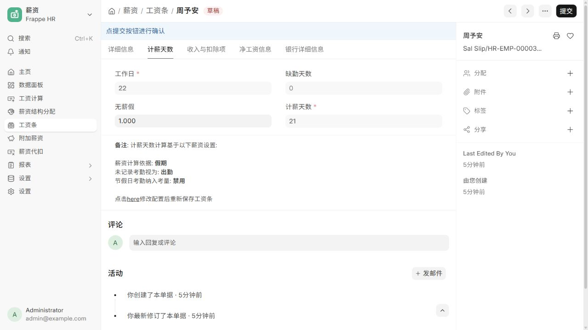
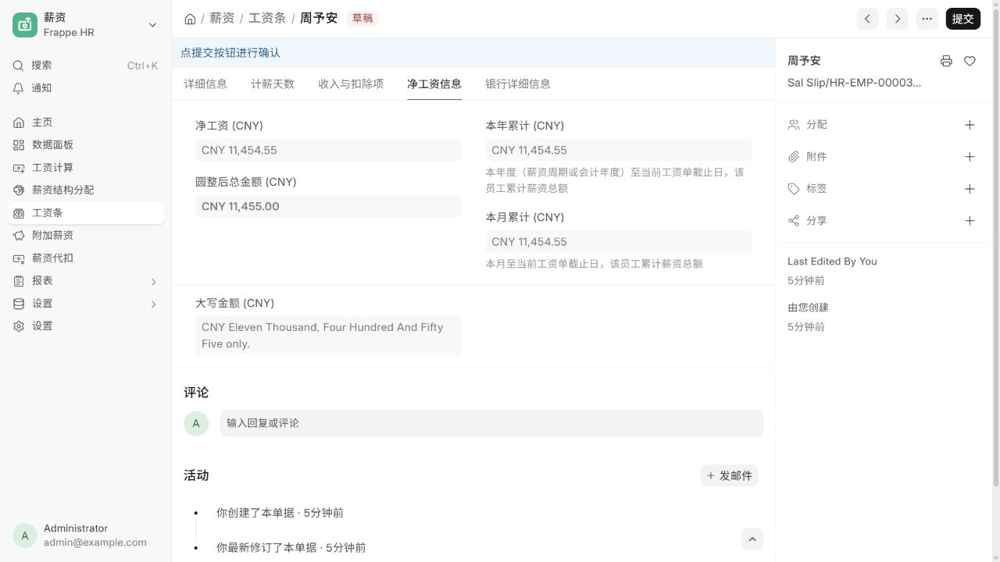

# 官方源库运行环境

这套配置在 Windows 的现有 WSL Ubuntu-22.04 中使用 Docker 运行官方 HRMS、ERPNext 与 Frappe 源码。与 `site/` 中的独立教学界面分开。

- 本机访问地址：`http://127.0.0.1:8191`
- 站点：`hrms.localhost`
- 应用分支：Frappe / ERPNext / HRMS 均为 `version-16`
- HRMS 本地源码：仓库根目录 `.local/frappe-hrms/upstream/`
- 实际运行源码：应用容器内 `/home/frappe/hrms-workspace/frappe-bench/apps/`
- 服务组：`research-frappe-hrms`
- 数据库与应用数据：该服务组专用 Docker volumes
- 账号文件：仓库根目录 `.local/frappe-hrms/local-account.json`
- 数据库和管理员密码：`.local/frappe-hrms/runtime.env`，不纳入版本控制

只映射本机回环地址的 8191 / 9191 端口，不开放数据库端口，不配置银行、邮箱或外部服务。该配置用于本地评估；`bench start` 为开发运行方式。

## 启动与查看状态

在 Windows PowerShell 运行：

```powershell
wsl -d Ubuntu-22.04 -u root -- docker compose --env-file /mnt/f/codex_project/0919_codex_project/.local/frappe-hrms/runtime.env -f /mnt/f/codex_project/0919_codex_project/projects/011-frappe-hrms/runtime/compose.yaml up -d
wsl -d Ubuntu-22.04 -u root -- docker logs --tail 50 research-frappe-hrms-app-1
```

首次启动需要下载源码、安装依赖、构建资源和创建站点；以日志和 HTTP 实际可访问为就绪标准。`up -d` 成功不代表初始化已完成。

本次已完成安装和导入，Windows 端登录页返回 HTTP 200，并通过浏览器以 Administrator 登录。实际版本：HRMS 16.19.0（`7e0fba4`）、ERPNext 16.35.0（`12cd563`）、Frappe 16.34.0（`c1f1e8e`）。

Windows 需要保持 WSL 运行。本次使用隐藏的 `wsl ... sleep infinity` 进程维持环境；重启电脑后需要重新启动 WSL 和上述服务。当前固定 webserver_port 为 8000，避免 Bench 自动选择 8001 后与容器端口映射不符。

## 官方实例体验顺序

1. 登录后进入桌面的「Frappe HR系统」，可看到招聘、假期、薪资、绩效、考勤等官方模块。
2. 打开 [工资条](http://127.0.0.1:8191/desk/salary-slip)，查看 6 张由官方引擎计算的 2026 年 9 月工资条。
3. 周予安的工资条：基本工资 12,000 元，22 个工作日，1 天已批准无薪假，计薪 21 天，结果 11,454.55 元。其他员工未配置无薪假，工资为各自基本工资。
4. 打开 [员工](http://127.0.0.1:8191/desk/employee)、[请假申请](http://127.0.0.1:8191/desk/leave-application) 和 [考勤](http://127.0.0.1:8191/desk/attendance)，查看关联单据。
5. 招聘模块已有一个虚拟前端岗位和两名虚拟候选人，可继续创建面试与录用流程。

工资单当前为草稿，年假申请保留待审批状态，便于继续操作；无薪假已提交以验证工资联动。这里的金额未计算中国个税和社保。

官方页面实际截图（2026-09-22）：





## 停止（保留数据）

```powershell
wsl -d Ubuntu-22.04 -u root -- docker compose --env-file /mnt/f/codex_project/0919_codex_project/.local/frappe-hrms/runtime.env -f /mnt/f/codex_project/0919_codex_project/projects/011-frappe-hrms/runtime/compose.yaml stop
```

不要对共享 Docker 环境执行全局停止或清理。不要使用 `down -v`，它会删除本项目的持久数据。

## 虚拟演示资料

`seed_demo.py` 通过真实 Frappe Document API 建立虚拟公司、6 位员工、假期额度、请假、考勤、工资结构、工资单和招聘资料。工资单由官方 Python 控制器计算，不使用先前网页的 JavaScript 模拟模型。

站点安装完成后，使用以下命令写入或补齐演示资料（脚本按名称检查已有记录）：

```powershell
wsl -d Ubuntu-22.04 -u root -- docker exec -u frappe -w /home/frappe/hrms-workspace/frappe-bench research-frappe-hrms-app-1 env/bin/python /workspace/seed_demo.py
```

演示资料不代表中国薪税合规配置。薪资项目仅配置基础工资，未配置个税、社保和公积金。所有记录均用于演示，不发生真实付款。

## 官方来源

- [HRMS 官方部署说明](https://github.com/frappe/hrms#development-setup)
- [HRMS 官方初始化脚本](https://github.com/frappe/hrms/blob/version-16/docker/init.sh)
- [Frappe 官方 Docker 项目](https://github.com/frappe/frappe_docker)
- 官方 Bench 镜像本次使用的 linux/amd64 摘要：`sha256:93916be875f8db8cdd944f67cf9498140cc4dfb05288048414f33fae4eb3f106`。Docker Hub 下载缓慢时使用 Google Docker Hub 缓存获取相同摘要的内容。

`start.sh` 和 `compose.yaml` 是按官方开发部署方式编写的本项目配置，调整为独立数据卷、固定 v16 分支和本机回环地址。
